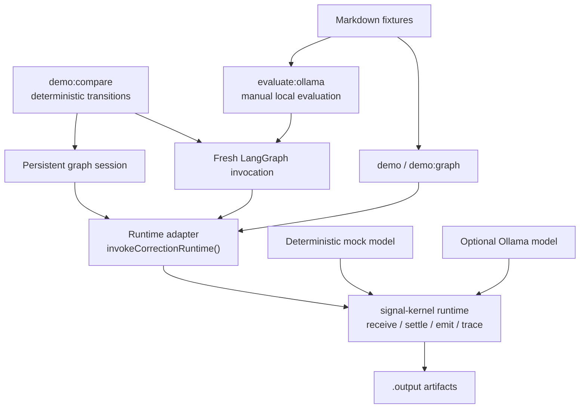
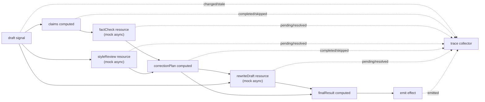

# reactive-correction-graph

Reproducible CLI demo for validating a signal-kernel powered reactive
correction runtime inside a LangGraph workflow.

See [TDD Workflow](./docs/tdd-workflow.md) for the red-green-refactor process used to add runtime behavior.
See [Chinese Technical Article Draft](./docs/reactive-correction-graph-zh.md) for a Chinese explanation of the architecture and positioning.
See [Local LLM Provider](./docs/local-llm-provider.md) for the optional Ollama demo path.

## Architecture



## Runtime Flow



## Reproduce

Prerequisites:

- Node.js 22
- pnpm 10.11.0, as pinned by `packageManager` in `package.json`

From a fresh clone, run:

```bash
pnpm install --frozen-lockfile
pnpm typecheck
pnpm test
pnpm run demo:compare
```

This path uses deterministic mock model functions. It does not require Ollama,
an API key, LangSmith, a database, or a sibling checkout of signal-kernel.

When changing dependencies, verify that `package.json` still matches the
committed lockfile:

```bash
pnpm run verify:lockfile
```

`demo:compare` writes:

- `.output/result.md`
- `.output/state.json`
- `.output/trace.json`
- `.output/comparison.json`
- `.output/savings.json`
- `.output/execution-summary.json`
- `.output/manifest.json`

Inspect them in this order:

1. `manifest.json` identifies this run and the schemas of every available
   artifact.
2. `savings.json` shows per-update avoided calls, reused receives, and
   superseded calls.
3. `execution-summary.json` shows recomputed, reused, superseded, and emitted
   work for each update.
4. `comparison.json` shows cumulative eager and reactive provider call counts
   for the style-only and claim-changing transitions.
5. `result.md` shows the representative revised draft and correction summary.
6. `state.json` shows the final persistent-session state and its runtime trace.
7. `trace.json` isolates that runtime lifecycle for easier inspection.

## Comparison Evidence

The comparison records cumulative provider calls across an initial input and
one or two updates:

| Scenario | Execution | Fact check | Style review | Rewrite | Final result |
| --- | --- | ---: | ---: | ---: | --- |
| Style-only update | Eager graph / fresh runtime | 2 | 2 | 2 | Produced |
| Style-only update | Persistent reactive session | 1 | 2 | 2 | Produced |
| Claim-changing update | Eager graph / fresh runtime | 3 | 3 | 3 | Produced |
| Claim-changing update | Persistent reactive session | 2 | 3 | 3 | Produced |

For both scenarios, `finalResultsMatch` is `true`. Within these fixed
deterministic transitions, the evidence shows:

- A style-only update reuses the settled fact-check result in the persistent
  reactive session.
- A claim-changing update invalidates fact-check work and performs it again.
- Rewrite work runs once per logical input in both execution modes.
- Selective invalidation preserves the same deterministic final result as the
  fresh eager baseline used by this demo.

## Evidence Boundaries

Execution counts answer how much work ran and whether a fixed transition reused
or superseded work. They do not answer whether an LLM response is factually
correct, well written, or useful.

| Evidence | What it supports | What it does not prove |
| --- | --- | --- |
| `avoidedCalls`, `reusedReceives`, `supersededCalls` | Execution efficiency for the fixed comparison | Factual accuracy or correction quality |
| Structural reliability score and hard gates | Runtime settlement, coverage, stale-result safety, and session isolation | Provider portability or semantic correctness |
| Provider compatibility rate | How often one provider/model satisfies the runtime contract | Accuracy of accepted answers |
| Repeated verification attempts | Amount of deliberate verification work | Independent corroboration unless verifier and evidence sources differ |
| `subjectiveCorrectionQuality` | Reserved boundary for a future evaluator | Nothing while its value is `not-evaluated` |

Intentional verification and accidental recomputation are different counters.
Repeating the same fact check may be useful, but repetition alone does not add
confidence. A future corroboration benchmark must record verifier identity,
evidence sources, agreement, and disagreement separately from reactive
recomputation.

## Limitations

- This is a fixed deterministic comparison, not a latency benchmark, token
  benchmark, cost benchmark, or general performance benchmark.
- Provider call counts do not measure CPU usage, memory usage, scheduler
  overhead, concurrency, or production scalability.
- Matching deterministic outputs does not prove factual correctness, writing
  quality, or usefulness of an LLM-generated correction.
- The eager baseline deliberately creates a fresh correction runtime for each
  graph invocation. The comparison does not claim that LangGraph cannot implement reuse,
  caching, checkpointing, or a different workflow design.
- The two scenarios demonstrate this runtime contract only; they do not prove
  that every agent workflow benefits from reactive invalidation.
- Ollama evaluation is a separate manual path, and its
  `subjectiveCorrectionQuality` remains `not-evaluated`.

## Fixtures

| Fixture | Focus |
| --- | --- |
| [`src/examples/input.md`](./src/examples/input.md) | Explanatory mixed intent, fact-check, and style signals |
| [`src/examples/fact-correction.md`](./src/examples/fact-correction.md) | Fact-check correction without a style guide |
| [`src/examples/style-correction.md`](./src/examples/style-correction.md) | Style correction without a tentative fact signal |

The deterministic comparison uses fixed internal transitions so its operation
counts remain stable. The three Markdown fixtures are used by the standalone
demo and the optional local LLM evaluation.

## Other Commands

```bash
pnpm demo ./src/examples/input.md
pnpm run demo:graph
```

Both commands use the deterministic mock provider by default and write
`result.md`, `state.json`, `trace.json`, and `manifest.json` under `.output`.

Optional Ollama commands are manual integration paths:

```bash
pnpm run demo:ollama ./src/examples/input.md
pnpm run evaluate:ollama
```

Ollama setup, PowerShell syntax, POSIX syntax, trial configuration, and report
interpretation are documented in [Local LLM Provider](./docs/local-llm-provider.md).

## Continuous Integration

[`.github/workflows/ci.yml`](./.github/workflows/ci.yml) runs frozen dependency
installation, typechecking, and deterministic tests for pushes and pull
requests. The manual Ollama smoke test remains skipped unless explicitly
configured outside the default CI workflow.
