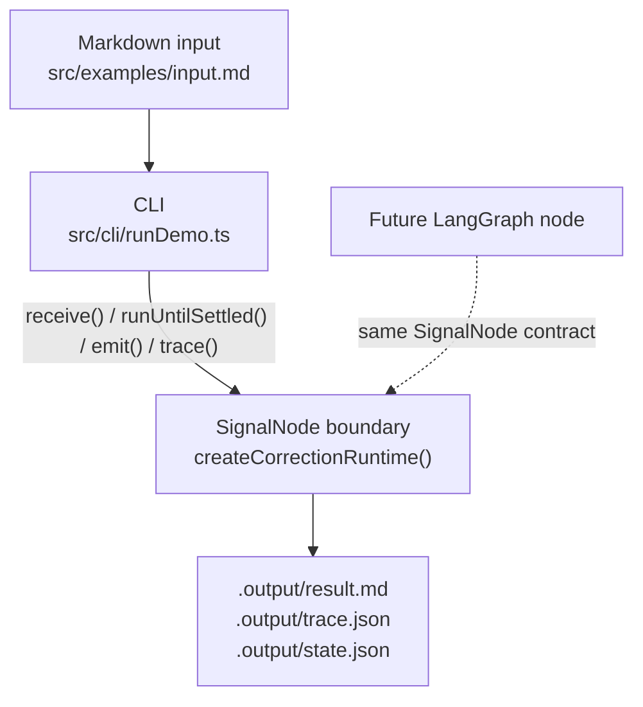
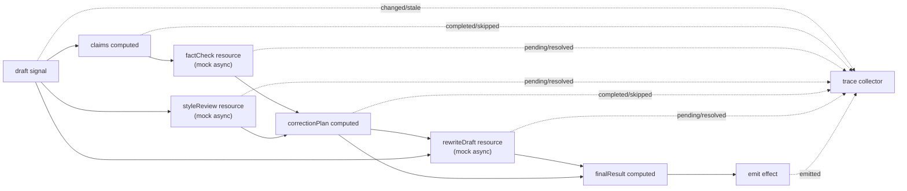

# reactive-correction-graph

CLI scaffold for validating a signal-kernel powered reactive correction runtime.

See [TDD Workflow](./docs/tdd-workflow.md) for the red-green-refactor process used to add runtime behavior.
See [Chinese Technical Article Draft](./docs/reactive-correction-graph-zh.md) for a Chinese explanation of the architecture and positioning.
See [Local LLM Provider](./docs/local-llm-provider.md) for the optional Ollama demo path.

## Architecture



## Runtime Flow



## Run

```bash
pnpm install
pnpm demo ./src/examples/input.md
pnpm run demo:graph
```

The explanatory fixture is [`src/examples/input.md`](./src/examples/input.md).
Its JSON front matter supplies `userIntent` and `styleGuide`, while the draft
contains a tentative claim with the word `maybe`. With the deterministic mock
provider, these inputs produce separate intent, style, and fact-check actions.

The demos write:

- `.output/result.md`
- `.output/trace.json`
- `.output/state.json`

Inspect the artifacts in this order:

1. `result.md` shows the revised draft, correction summary, and unresolved
   factual issue.
2. `state.json` shows the extracted claims and structured correction state. In
   graph mode it also contains `graphTrace` and the inner runtime `trace`.
3. `trace.json` shows the runtime lifecycle, including resource `pending` and
   `resolved` events followed by `finalResult emitted`.
