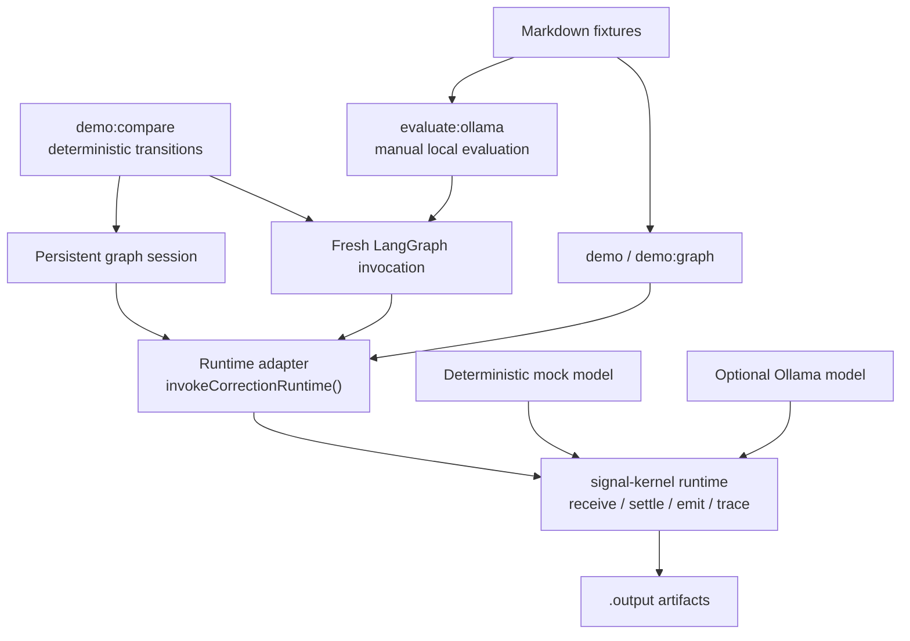
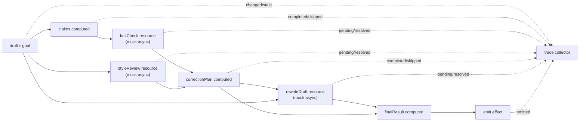

# reactive-correction-graph

Reproducible CLI demo for validating a signal-kernel powered reactive
correction runtime inside a LangGraph workflow.

See [TDD Workflow](./docs/tdd-workflow.md) for the red-green-refactor process used to add runtime behavior.
See [Headless Session SDK](./docs/headless-session-sdk.md) for how CLI, web, and LangGraph integrations depend on the shared session boundary.
See [Durable LangGraph Session Boundary](./docs/durable-langgraph-session.md) for the checkpoint and restore boundary around graph sessions.
See [Chinese Technical Article Draft](./docs/reactive-correction-graph-zh.md) for a Chinese explanation of the architecture and positioning.
See [Local LLM Provider](./docs/local-llm-provider.md) for the optional Ollama demo path.

## Value Statement

Reactive Correction Graph reduces wasted recomputation inside agent workflow nodes.
It makes reuse, invalidation, and emitted results observable through traces, artifacts, and reference tests.
It is not positioned as a LangGraph replacement, LangSmith replacement, or general LLM quality benchmark.

## Public SDK Surface

This repository is currently a private reference implementation. The package
surface is used to validate future SDK boundaries; it is not published to npm
yet and should not be treated as a stable package release.

Supported examples import only from the package root:

```ts
import {
  createCorrectionSession,
  createCorrectionGraphSession,
  createCorrectionGraphCheckpoint,
  parseCorrectionGraphCheckpoint,
  restoreCorrectionSessionFromCheckpoint,
  createCorrectionSessionArtifactBundle,
} from "reactive-correction-graph";
```

The representative examples are:

- `src/examples/minimalSdkUsage.ts`
- `src/examples/langGraphCheckpointUsage.ts`

Private internals remain private. Do not import from `src/runtime/*`,
`src/graph/*`, `src/session/*`, or other implementation paths in docs,
examples, or downstream experiments. If a capability is meant to be reused, it
should first be promoted through `src/index.ts`.

Non-goals:

- This is not a React or Vue adapter.
- This is not a production LangGraph checkpointer.
- This is not a LangSmith replacement.
- This does not claim the current repo should be published as the final npm
  package; a future package can be extracted after the reference demo proves
  the boundary is useful.

## LangGraph Reference Integration

Task 39 keeps the LangGraph story focused on reference integration instead of
adding another built-in demo mode. LangGraph owns orchestration and checkpoint
policy, while signal-kernel owns node-local reactive invalidation and async
settling. The public SDK is the boundary between those layers.

Role split:

- LangGraph owns orchestration and checkpoint policy.
- signal-kernel owns node-local reactive invalidation and async settling.

Reference examples:

- `src/examples/langGraphReferenceWorkflow.ts` shows an external `StateGraph`
  with its own prepare, correction, and finalize nodes. The correction node uses
  `createCorrectionSession()` from the package root.
- `src/examples/langGraphPersistentSessionWorkflow.ts` shows repeated
  invocations through an explicit `createCorrectionGraphSession()` owned by a
  workflow factory. A second style-only invocation reuses fact-check work, while
  a separate workflow factory starts from a fresh session.

Rules for downstream integrations:

- Do not import from internal source paths; use `reactive-correction-graph`.
- Do not store sessions or runtimes in LangGraph state.
- Keep graph state JSON-compatible so checkpointing can remain a policy choice
  outside the runtime.
- Own persistent behavior explicitly through a session wrapper or workflow
  factory, not through module-level hidden state.
- Keep reference paths local-first and mock-first; this does not require
  LangSmith, a database, Ollama, or a production LangGraph checkpointer.

This path does not require LangSmith.

## Guided Local Demo Path

Use this local-first, mock-first path when evaluating the reference demo from a
fresh checkout:

- does not require Ollama
- does not require LangSmith
- does not require a database
- does not require an API key

The default guided path uses deterministic mock behavior only.
Optional integrations stay outside this guided path.

Run the deterministic command sequence:

```bash
pnpm install --frozen-lockfile
pnpm typecheck
pnpm test
pnpm run demo:compare
pnpm run demo:report
```

The expected `.output` artifacts are:

| Artifact | What it proves | What it does not prove |
| --- | --- | --- |
| `.output/result.md` | A representative correction result was serialized | Factual correctness or writing quality |
| `.output/state.json` | The final settled runtime state was captured | Production persistence or checkpoint durability |
| `.output/trace.json` | Runtime lifecycle events were recorded for one completed run | Latency, concurrency, or production scalability |
| `.output/manifest.json` | Compatible serialized artifacts can be indexed as a bundle | That every optional artifact is always present |
| `.output/report.html` | The bundle can render an offline evidence report | General LLM quality or semantic benchmark accuracy |

This path is intentionally deterministic. It proves the CLI, runtime session,
artifact bundle, public SDK boundary, and report generation can work together
before optional Ollama evaluation or future production integrations are added.

Then read the public SDK examples and LangGraph reference examples:

- [src/examples/minimalSdkUsage.ts](./src/examples/minimalSdkUsage.ts)
- [src/examples/langGraphReferenceWorkflow.ts](./src/examples/langGraphReferenceWorkflow.ts)
- [src/examples/langGraphPersistentSessionWorkflow.ts](./src/examples/langGraphPersistentSessionWorkflow.ts)

## Reference Scenario Definition

The next application layer starts with a fixed technical article correction
scenario. This is a reference application scenario, not a production app. Its
job is to make the recomputation story concrete before adding a larger web
product or provider-specific demo.

The scenario fixtures live in:

- [src/examples/reference-article.md](./src/examples/reference-article.md)
- [src/examples/reference-style-guide.md](./src/examples/reference-style-guide.md)
- [src/examples/reference-scenario.json](./src/examples/reference-scenario.json)

The scenario defines three ordered inputs:

- `initial`: establishes the baseline correction result.
- `style-only update`: changes style guidance while keeping the draft claims
  stable, so the demo can show reuse fact-check work.
- `claim-changing update`: changes the draft claims, so the demo can show
  recompute fact-check work.

This keeps the reference demo focused on runtime behavior: which work can be
reused, which work must be recomputed, and how those decisions become visible
through trace and artifact evidence.

## Reference Scenario Runner

Run the deterministic reference scenario with:

```bash
pnpm run demo:reference
```

The runner is mock-first and uses deterministic mock model behavior. It does not require Ollama, LangSmith, API keys, a database, or a browser.

By default, artifacts are written under `./.output/reference`. A custom output
directory can be provided with either an environment variable or a CLI option:

```bash
REFERENCE_OUTPUT_DIR=./.output/reference pnpm run demo:reference
pnpm run demo:reference -- --output-dir ./.output/reference
```

The reference runner writes:

| Artifact | Purpose |
| --- | --- |
| `.output/reference/result.md` | Human-readable final correction result |
| `.output/reference/state.json` | Final settled runtime state |
| `.output/reference/trace.json` | Runtime lifecycle trace for the scenario |
| `.output/reference/execution-summary.json` | Per-receive recompute, reuse, and emitted-work summary |
| `.output/reference/savings.json` | Deterministic recomputation-savings report placeholder |
| `.output/reference/manifest.json` | Artifact bundle index for report and tooling consumers |

## Architecture


```mermaid
flowchart TD
  markdown["Markdown fixtures"]
  demo["demo / demo:graph"]
  comparison["demo:compare<br/>deterministic transitions"]
  evaluation["evaluate:ollama<br/>manual local evaluation"]
  eager["Fresh LangGraph invocation"]
  session["Persistent graph session"]
  adapter["Runtime adapter<br/>invokeCorrectionRuntime()"]
  runtime["signal-kernel runtime<br/>receive / settle / emit / trace"]
  mock["Deterministic mock model"]
  ollama["Optional Ollama model"]
  artifacts[".output artifacts"]

  markdown --> demo
  markdown --> evaluation
  demo --> adapter
  comparison --> eager
  comparison --> session
  evaluation --> eager
  eager --> adapter
  session --> adapter
  adapter --> runtime
  mock --> runtime
  ollama --> runtime
  runtime --> artifacts
```

## Runtime Flow


```mermaid
flowchart LR
  draft["draft signal"]
  claims["claims computed"]
  factCheck["factCheck resource<br/>(mock async)"]
  styleReview["styleReview resource<br/>(mock async)"]
  plan["correctionPlan computed"]
  rewrite["rewriteDraft resource<br/>(mock async)"]
  final["finalResult computed"]
  effect["emit effect"]
  trace["trace collector"]

  draft --> claims
  claims --> factCheck
  draft --> styleReview
  factCheck --> plan
  styleReview --> plan
  plan --> rewrite
  draft --> rewrite
  rewrite --> final
  plan --> final
  final --> effect

  draft -. changed/stale .-> trace
  claims -. completed/skipped .-> trace
  factCheck -. pending/resolved .-> trace
  styleReview -. pending/resolved .-> trace
  plan -. completed/skipped .-> trace
  rewrite -. pending/resolved .-> trace
  effect -. emitted .-> trace
```

## Live Events, Trace, And Artifacts

The local web demo exposes runtime activity as server-sent events at:

```txt
GET /api/sessions/:id/events
```

Each message is a `LiveTraceEvent` with a monotonically increasing `sequence`
and the same TraceEvent payload used by the settled runtime trace. The live
stream is for in-flight observation: it lets the UI show resource work such as
`styleReview pending` before the invocation response finishes.

`trace.json` is the settled artifact form of that lifecycle. It is written after
a CLI/demo run completes and is the source used by reports, execution summaries,
and artifact-bundle consumers. The live event stream does not enter the artifact bundle;
`.output/manifest.json` only records serialized artifacts such as
`result.md`, `state.json`, `trace.json`, `comparison.json`, and `report.html`.

In short:

| Layer | Purpose | Durability |
| --- | --- | --- |
| Live SSE events | In-flight developer feedback for one running session | Ephemeral |
| `trace.json` | Settled runtime lifecycle for one completed run | Serialized artifact |
| `manifest.json` artifact bundle | Versioned index of compatible output files | Offline consumer boundary |

## Reproduce

Prerequisites:

- Node.js 22
- pnpm 10.11.0, as pinned by `packageManager` in `package.json`

From a fresh clone, run:

```bash
pnpm install --frozen-lockfile
pnpm exec playwright install chromium
pnpm typecheck
pnpm test
pnpm run test:browser
pnpm run demo:compare
pnpm run demo:report
```

This path uses deterministic mock model functions. It does not require Ollama,
an API key, LangSmith, a database, or a sibling checkout of signal-kernel.

When changing dependencies, verify that `package.json` still matches the
committed lockfile:

```bash
pnpm run verify:lockfile
```

`demo:compare` writes:

- `.output/result.md`
- `.output/state.json`
- `.output/trace.json`
- `.output/comparison.json`
- `.output/savings.json`
- `.output/execution-summary.json`
- `.output/manifest.json`

`demo:report` loads that versioned bundle without starting a runtime or server,
then writes `.output/report.html` and registers it in the manifest.

Inspect them in this order:

1. `report.html` presents the comparison, receive-level work, reliability
   boundary, and evidence limits in one static document.
2. `manifest.json` identifies this run and the schemas of every available
   artifact.
3. `savings.json` shows per-update avoided calls, reused receives, and
   superseded calls.
4. `execution-summary.json` shows recomputed, reused, superseded, and emitted
   work for each update.
5. `comparison.json` shows cumulative eager and reactive provider call counts
   for the style-only and claim-changing transitions.
6. `result.md` shows the representative revised draft and correction summary.
7. `state.json` shows the final persistent-session state and its runtime trace.
8. `trace.json` isolates that runtime lifecycle for easier inspection.

## Comparison Evidence

The comparison records cumulative provider calls across an initial input and
one or two updates:

| Scenario | Execution | Fact check | Style review | Rewrite | Final result |
| --- | --- | ---: | ---: | ---: | --- |
| Style-only update | Eager graph / fresh runtime | 2 | 2 | 2 | Produced |
| Style-only update | Persistent reactive session | 1 | 2 | 2 | Produced |
| Claim-changing update | Eager graph / fresh runtime | 3 | 3 | 3 | Produced |
| Claim-changing update | Persistent reactive session | 2 | 3 | 3 | Produced |

For both scenarios, `finalResultsMatch` is `true`. Within these fixed
deterministic transitions, the evidence shows:

- A style-only update reuses the settled fact-check result in the persistent
  reactive session.
- A claim-changing update invalidates fact-check work and performs it again.
- Rewrite work runs once per logical input in both execution modes.
- Selective invalidation preserves the same deterministic final result as the
  fresh eager baseline used by this demo.

## Evidence Boundaries

Execution counts answer how much work ran and whether a fixed transition reused
or superseded work. They do not answer whether an LLM response is factually
correct, well written, or useful.

| Evidence | What it supports | What it does not prove |
| --- | --- | --- |
| `avoidedCalls`, `reusedReceives`, `supersededCalls` | Execution efficiency for the fixed comparison | Factual accuracy or correction quality |
| Structural reliability score and hard gates | Runtime settlement, coverage, stale-result safety, and session isolation | Provider portability or semantic correctness |
| Provider compatibility rate | How often one provider/model satisfies the runtime contract | Accuracy of accepted answers |
| Repeated verification attempts | Amount of deliberate verification work | Independent corroboration unless verifier and evidence sources differ |
| `subjectiveCorrectionQuality` | Reserved boundary for a future evaluator | Nothing while its value is `not-evaluated` |

Intentional verification and accidental recomputation are different counters.
Repeating the same fact check may be useful, but repetition alone does not add
confidence. A future corroboration benchmark must record verifier identity,
evidence sources, agreement, and disagreement separately from reactive
recomputation.

## Evidence And Benchmark Story

The demo evidence is split into named categories so the benchmark story stays
grounded in concrete artifacts and tests:

| Evidence category | Artifact or test sources |
| --- | --- |
| Recomputation savings | `.output/savings.json`, `.output/comparison.json`, `.output/execution-summary.json` |
| Session reuse | `.output/trace.json`, `.output/state.json`, `src/examples/langGraphPersistentSessionWorkflow.test.ts` |
| State safety | `src/examples/langGraphReferenceWorkflow.test.ts`, `src/graph/correctionGraphCheckpoint.test.ts` |
| Public boundary safety | `src/examples/publicImportGuard.test.ts`, `src/publicSdk.test.ts`, `src/publicSdkPackaging.test.ts` |
| Report reproducibility | `.output/manifest.json`, `.output/report.html`, `src/report/createEvidenceReportViewModel.test.ts` |

Recomputation savings are scoped to the deterministic style-only and claim-changing transitions.
`comparison.json` compares eager fresh-runtime calls against persistent reactive-session calls.
`savings.json` reports `avoidedCalls`, `reusedReceives`, and `supersededCalls`.
`execution-summary.json` groups recomputed, reused, superseded, and emitted work by receive.

For the style-only update, the persistent reactive session avoids one fact-check call because the settled fact-check result is reused.
For the claim-changing update, fact-check work runs again, so the demo does not claim fact-check reuse.
Session reuse is evidenced by receive epochs in `.output/trace.json` and `.output/state.json`.
`src/examples/langGraphPersistentSessionWorkflow.test.ts` verifies that one workflow session reuses receives while a separate workflow starts isolated.

State safety means LangGraph state remains JSON-compatible workflow facts.
`src/examples/langGraphReferenceWorkflow.test.ts` round-trips workflow state through JSON and rejects live runtime handles.
`src/graph/correctionGraphCheckpoint.test.ts` verifies checkpoint restore, second receive behavior, and isolated restored sessions.
Runtime objects, sessions, signals, promises, subscriptions, and AbortController values stay out of graph state.

Public boundary safety means reference examples import through `reactive-correction-graph` instead of internal source paths.
`src/examples/publicImportGuard.test.ts` rejects relative imports, `/src/` imports, and package subpath imports in reference examples.
`src/publicSdk.test.ts` exercises representative session, graph session, checkpoint, and artifact APIs from the package root.
`src/publicSdkPackaging.test.ts` keeps the build metadata pointed at `dist/index.js` and `dist/index.d.ts`.

Trace evidence shows which runtime work changed, became stale, ran, resolved, was reused, or emitted.
Trace evidence does not prove factual correctness, writing quality, provider quality, or semantic usefulness.
Repeated verification records intentional verification attempts.
Repeated verification does not prove independent corroboration unless verifier identity, evidence sources, agreement, and disagreement are recorded separately.
Local LLM evaluation is a manual provider compatibility path.
Local LLM evaluation does not turn `subjectiveCorrectionQuality: not-evaluated` into a quality score.
The current demo is not a latency, token, cost, semantic accuracy, provider quality, or production durability benchmark.

## Limitations

- This is a fixed deterministic comparison, not a latency benchmark, token
  benchmark, cost benchmark, or general performance benchmark.
- Provider call counts do not measure CPU usage, memory usage, scheduler
  overhead, concurrency, or production scalability.
- Matching deterministic outputs does not prove factual correctness, writing
  quality, or usefulness of an LLM-generated correction.
- The eager baseline deliberately creates a fresh correction runtime for each
  graph invocation. The comparison does not claim that LangGraph cannot implement reuse,
  caching, checkpointing, or a different workflow design.
- The two scenarios demonstrate this runtime contract only; they do not prove
  that every agent workflow benefits from reactive invalidation.
- Ollama evaluation is a separate manual path, and its
  `subjectiveCorrectionQuality` remains `not-evaluated`.

## Fixtures

| Fixture | Focus |
| --- | --- |
| [`src/examples/input.md`](./src/examples/input.md) | Explanatory mixed intent, fact-check, and style signals |
| [`src/examples/fact-correction.md`](./src/examples/fact-correction.md) | Fact-check correction without a style guide |
| [`src/examples/style-correction.md`](./src/examples/style-correction.md) | Style correction without a tentative fact signal |

The deterministic comparison uses fixed internal transitions so its operation
counts remain stable. The three Markdown fixtures are used by the standalone
demo and the optional local LLM evaluation.

## Other Commands

```bash
pnpm demo ./src/examples/input.md
pnpm run demo:graph
```

Both commands use the deterministic mock provider by default and write
`result.md`, `state.json`, `trace.json`, and `manifest.json` under `.output`.

The interactive mock session runs locally without an API key:

```bash
pnpm run demo:web
```

Open `http://127.0.0.1:4173` to submit a draft through the persistent graph
session API.

Optional Ollama commands are manual integration paths:

```bash
pnpm run demo:ollama ./src/examples/input.md
pnpm run evaluate:ollama
pnpm run evaluate:corroboration -- "claim to verify"
```

Ollama setup, PowerShell syntax, POSIX syntax, trial configuration, and report
interpretation are documented in [Local LLM Provider](./docs/local-llm-provider.md).

## Continuous Integration

[`.github/workflows/ci.yml`](./.github/workflows/ci.yml) runs frozen dependency
installation, typechecking, and deterministic tests for pushes and pull
requests. The manual Ollama smoke test remains skipped unless explicitly
configured outside the default CI workflow.
