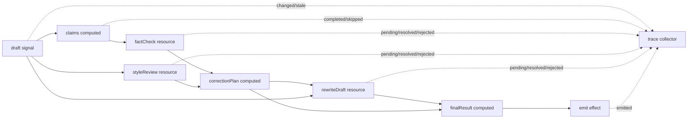

# 用 signal-kernel 在 LangGraph 節點內建立反應式修正引擎

這份文件是一篇中文技術文章草稿，用來整理 `reactive-correction-graph`
目前想證明的設計方向。它不是 README 的逐字翻譯，而是偏向未來對外講解時可以使用的版本。

## 核心問題

在 AI workflow 裡，我們常常會遇到一種情境：

1. 使用者輸入一段草稿。
2. 系統從草稿抽取 claims。
3. fact-check agent 檢查 claims。
4. style-review agent 檢查語氣與格式。
5. correction planner 根據檢查結果產生修正計畫。
6. rewrite agent 根據修正計畫重寫草稿。
7. 最後產生 final result。

這看起來像一條線性流程，但實際上不是。

如果使用者只改了 style guide，理論上不需要重新 fact-check。  
如果使用者只調整標題，但 claims 沒變，理論上也不需要重新 fact-check。  
如果 rewrite 正在 pending，系統仍然應該保留上一版穩定輸出。  
如果舊的 async result 比新的輸入晚回來，它不能覆蓋最新狀態。

這類問題的難點不在於「能不能跑一次」，而在於：

> 當狀態反覆變動、async 工作交錯完成時，系統能不能只重算必要的部分，並產生可觀測、可驗證的結果。

## 這個專案想證明什麼

這個專案的核心假設是：

> LangGraph 適合處理外層 agent workflow 編排，而 signal-kernel 適合處理單一 workflow node 內部的細粒度 reactive async dependency。

換句話說，`signal-kernel` 不是要取代 LangGraph。  
它更像是 LangGraph node 裡的一個 reactive execution engine。

分工可以這樣看：

| Layer | Responsibility |
| --- | --- |
| LangGraph | 外層 workflow 編排，控制節點、邊、狀態傳遞 |
| signal-kernel | 節點內部的 signal、computed、effect 與 async resource settling |
| LLM provider | 真實模型呼叫，例如 fact check、style review、rewrite |
| CLI | 第一階段 runtime 驗證與 trace 輸出 |
| Future UI | trace、dependency graph、snapshot 的視覺化 |

目前專案還沒有接 LangGraph，也沒有接真實 LLM。這是刻意的。

第一階段的目標是先證明 runtime 行為本身穩定：

```txt
CLI
  -> invokeCorrectionRuntime()
    -> createCorrectionRuntime()
      -> signal-kernel runtime
```

未來接 LangGraph 時，外層會變成：

```txt
LangGraph node
  -> invokeCorrectionRuntime()
    -> createCorrectionRuntime()
      -> signal-kernel runtime
```

## Runtime Flow

目前 correction runtime 的內部流程是：



這裡最重要的不是流程圖本身，而是每個節點的 invalidation 行為。

例如：

- draft 改變時，claims 需要重新計算。
- claims 改變時，factCheck 需要重新執行。
- styleGuide 改變時，styleReview 需要重新執行，但 factCheck 不應該重跑。
- correctionPlan 改變時，rewriteDraft 需要重跑。
- rewriteDraft pending 時，snapshot 應該保留上一版 stable final result。

這正是 reactive runtime 比純手寫 orchestration 更有價值的地方。

## SignalNode Contract

目前 runtime 對外暴露的核心 contract 是：

```ts
type SignalNode<InputState, OutputState, SnapshotState = unknown> = {
  receive(state: InputState): void;
  runUntilSettled(): Promise<void>;
  emit(): Partial<OutputState>;
  snapshot(): SnapshotState;
  trace(): TraceEvent[];
};
```

這個 contract 讓 runtime 可以被 CLI、測試、未來 LangGraph node，甚至其他 orchestrator 呼叫。

重點是外部系統不需要知道內部 signal graph 怎麼接。  
外部只需要知道：

1. 給 runtime 一個 input。
2. 等它 settle。
3. 拿 output。
4. 拿 trace。
5. 需要觀察 pending/stable 狀態時拿 snapshot。

## 為什麼需要 snapshot

`emit()` 和 `snapshot()` 的用途不一樣。

`emit()` 代表目前已經 settle 的 correction output。  
`snapshot()` 代表 runtime 當下的觀測狀態。

例如 rewrite 正在 pending 時，`emit()` 可能還不應該輸出新的 final result，因為新的 rewrite 還沒有完成。  
但外部工具仍然需要知道：

- rewriteDraft 現在是不是 pending。
- factCheck 是否 success。
- styleReview 是否 success。
- 上一版穩定 finalResult 還在不在。

所以 snapshot 的角色是：

> 提供外部工具觀測 runtime 狀態，而不需要暴露內部 signal/computed/resource 實作細節。

目前 snapshot 類型大致是：

```ts
type CorrectionRuntimeSnapshot = {
  stableFinalResult?: FinalResult;
  statuses: {
    factCheck: "idle" | "pending" | "success" | "error" | "cancelled";
    styleReview: "idle" | "pending" | "success" | "error" | "cancelled";
    rewriteDraft: "idle" | "pending" | "success" | "error" | "cancelled";
  };
};
```

這不是 React/Vue adapter。

它比較像是：

```txt
runtime adapter for orchestration and observability
```

也就是給 LangGraph、CLI inspector、debug tool、trace viewer 這類外部系統銜接用。

## correctionRuntimeAdapter 的定位

目前新增的 `correctionRuntimeAdapter` 是為了建立未來 LangGraph node 的邊界。

它的形狀很單純：

```ts
const state = await invokeCorrectionRuntime({
  draft,
  userIntent,
  styleGuide,
});
```

內部做的事情是：

```txt
createCorrectionRuntime()
runtime.receive(input)
await runtime.runUntilSettled()
return {
  ...input,
  ...runtime.emit(),
  trace: runtime.trace(),
  snapshot: runtime.snapshot()
}
```

這個 adapter 目前沒有 import LangGraph。這是刻意的。

它先證明一件事：

> correction runtime 可以被包成 plain input/output function。

未來真的接 LangGraph 時，LangGraph node 應該只是薄薄的一層 wrapper：

```ts
async function reactiveCorrectionNode(state: GraphState) {
  return invokeCorrectionRuntime(state);
}
```

這樣 LangGraph 負責外層流程，`signal-kernel` 負責節點內部的 reactive settling。

## Trace 的價值

這個專案不是只輸出 final result。它也輸出 trace。

trace 會記錄：

- `started`
- `completed`
- `changed`
- `stale`
- `pending`
- `resolved`
- `rejected`
- `skipped`
- `emitted`

這對 AI workflow 很重要，因為 AI 系統的錯誤通常不是單點錯誤，而是狀態傳遞、async timing、dependency invalidation 出問題。

如果沒有 trace，當 final result 不對時，很難回答：

- 是 claims 抽錯了嗎？
- 是 factCheck 沒重跑嗎？
- 是 styleReview 不該重跑但重跑了嗎？
- 是舊的 rewrite 結果覆蓋新的輸入嗎？
- 是某個 async resource error 但 runtime 沒有及早失敗嗎？

trace 讓這些問題變成可以測試、可以觀察、可以回放的行為。

## 目前已經驗證到哪裡

目前 TDD backlog 已經覆蓋到 Task 12。

已驗證的行為包括：

1. Basic settling  
   markdown draft 可以 settle 成 finalResult。

2. Trace lifecycle  
   trace 會記錄 changed、stale、pending、resolved、emitted。

3. Second receive  
   runtime 可以接收第二次輸入並重新 settle。

4. Style guide change  
   只改 styleGuide 時，styleReview 和 rewriteDraft 會重跑，factCheck 不會重跑。

5. Draft claim change  
   claims 改變時，factCheck、correctionPlan、rewriteDraft、finalResult 都會更新。

6. Style-only draft change  
   draft 文字改變但 claims 沒變時，可以跳過 factCheck。

7. Runtime snapshot contract  
   pending 狀態下仍可觀測 stable final result 和 resource statuses。

8. Pending rewrite keeps previous output  
   rewrite pending 時，上一版 revisedDraft 仍可讀。

9. CLI smoke test  
   CLI 可以輸出 `.output/result.md`、`.output/trace.json`、`.output/state.json`。

10. Latest receive wins  
    第二次 receive 發生後，舊 async result 不能覆蓋最新輸出。

11. Async error trace  
    async step 失敗時，runtime 會清楚 reject，trace 會記錄 rejected，snapshot 會顯示 error。

12. Adapter boundary  
    runtime 可以被包成 JSON-compatible plain state adapter，作為未來 LangGraph node 的前置邊界。

## 為什麼用 TDD 做這個專案

這個專案很適合 TDD，原因是它的錯誤常常不是肉眼看 UI 就能看出來的。

例如：

- factCheck 到底有沒有被跳過？
- 第二次 receive 後，finalResult 是不是新的？
- rewrite pending 時，上一次 stable output 是否仍存在？
- async error 是不是立刻讓 runUntilSettled 失敗？

這些都不是畫面好不好看的問題，而是 runtime 行為正不正確的問題。

所以目前採用的方式是：

```txt
Red:
  先寫一個只描述外部行為的測試。

Green:
  用最小實作讓測試通過。

Refactor:
  綠燈後再整理結構。
```

測試只透過公開介面驗證：

- `createCorrectionRuntime()`
- `runtime.receive()`
- `runtime.runUntilSettled()`
- `runtime.emit()`
- `runtime.trace()`
- `runtime.snapshot()`
- `invokeCorrectionRuntime()`
- CLI command

避免測試綁死內部 computed/resource 的實作細節。

## 這個專案目前還沒有做什麼

目前還沒有做：

- React adapter
- Vue adapter
- Next.js UI
- 真實 LangGraph integration
- 真實 LLM 呼叫
- RAG
- database
- multi-agent system
- production deployment

這些不是做不到，而是還不是第一階段該做的事。

目前最重要的是先把 runtime contract 穩住。

## 下一步發展

接下來可以開始做 LangGraph minimal proof of concept。

建議順序是：

1. 加入最小 LangGraph dependency。
2. 建立一個簡單 GraphState。
3. 建立 `prepareInputNode`。
4. 建立 `reactiveCorrectionNode`，內部呼叫 `invokeCorrectionRuntime()`。
5. 建立 `finalizeNode`。
6. 驗證 graph 可以跑完並產生 final state。

最小 LangGraph 流程可以先長這樣：

```txt
START
  -> prepareInput
  -> reactiveCorrectionNode
  -> finalize
  -> END
```

重點不是把 LangGraph 用得很複雜。  
重點是證明：

> LangGraph 可以把 correction runtime 當成一個普通 node，而 signal-kernel 可以在 node 內部處理更細的 reactive async dependency。

## 對外文章可以怎麼定位

如果未來要寫成中文技術文章，可以用這樣的主軸：

> 我不是要重做 LangGraph，而是想探索：當一個 LangGraph node 內部變得高度動態時，能不能用 signal-kernel 管理細粒度 async dependency。

文章可以分成三篇：

### 第一篇：為什麼 AI workflow node 裡需要 reactive runtime

重點講問題：

- AI workflow 不是單純線性流程。
- async source 會交錯完成。
- 局部 invalidation 很難手寫。
- trace 對 debug 很重要。

### 第二篇：用 signal-kernel 做 correction runtime

重點講實作：

- signal、computed、resource、effect 的分工。
- draft -> claims -> factCheck/styleReview -> correctionPlan -> rewrite -> finalResult。
- snapshot 與 trace。
- TDD 怎麼驗證 runtime 行為。

### 第三篇：把 reactive runtime 包成 LangGraph node

重點講整合：

- LangGraph 負責外層 orchestration。
- signal-kernel 負責 node 內部 reactive settling。
- adapter boundary 為什麼先不 import LangGraph。
- 未來如何加真實 LLM。

## 總結

目前這個專案已經證明：

> signal-kernel 可以在 CLI demo 裡管理一個具備 async resource、局部 invalidation、trace、snapshot、error handling 的 correction runtime。

下一步要證明的是：

> 這個 runtime 可以被 LangGraph 當成普通 node 呼叫，並把 correction output、trace、snapshot 回傳成 graph state。

這個定位很重要。

它不是前端 UI adapter，也不是要取代 LangGraph。  
它是一個面向 workflow engine 的 reactive runtime adapter，目標是讓複雜 async dependency 在單一 node 內部變得可觀測、可測試、可組合。
