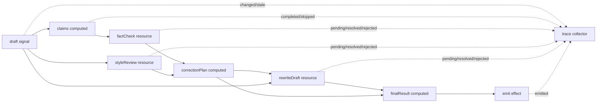

# 用 signal-kernel 在 LangGraph 節點內建立反應式修正引擎

這份文件是一篇中文技術文章草稿，用來整理 `reactive-correction-graph`
目前想證明的設計方向。它不是 README 的逐字翻譯，而是偏向未來對外講解時可以使用的版本。

## 核心問題

在 AI workflow 裡，我們常常會遇到一種情境：

1. 使用者輸入一段草稿。
2. 系統從草稿抽取 claims。
3. fact-check agent 檢查 claims。
4. style-review agent 檢查語氣與格式。
5. correction planner 根據檢查結果產生修正計畫。
6. rewrite agent 根據修正計畫重寫草稿。
7. 最後產生 final result。

這看起來像一條線性流程，但實際上不是。

如果使用者只改了 style guide，理論上不需要重新 fact-check。  
如果使用者只調整標題，但 claims 沒變，理論上也不需要重新 fact-check。  
如果 rewrite 正在 pending，系統仍然應該保留上一版穩定輸出。  
如果舊的 async result 比新的輸入晚回來，它不能覆蓋最新狀態。

這類問題的難點不在於「能不能跑一次」，而在於：

> 當狀態反覆變動、async 工作交錯完成時，系統能不能只重算必要的部分，並產生可觀測、可驗證的結果。

## 這個專案想證明什麼

這個專案的核心假設是：

> LangGraph 適合處理外層 agent workflow 編排，而 signal-kernel 適合處理單一 workflow node 內部的細粒度 reactive async dependency。

換句話說，`signal-kernel` 不是要取代 LangGraph。  
它更像是 LangGraph node 裡的一個 reactive execution engine。

分工可以這樣看：

| Layer | Responsibility |
| --- | --- |
| LangGraph | 外層 workflow 編排，控制節點、邊、狀態傳遞 |
| signal-kernel | 節點內部的 signal、computed、effect 與 async resource settling |
| LLM provider | 真實模型呼叫，例如 fact check、style review、rewrite |
| CLI | 第一階段 runtime 驗證與 trace 輸出 |
| Future UI | trace、dependency graph、snapshot 的視覺化 |

目前專案已完成最小 LangGraph integration，也能選擇性串接本機 Ollama。
不過預設測試與比較仍使用 deterministic mock model，避免把外部模型的不穩定性混進 runtime contract。

最初的 CLI 路徑先證明 runtime 行為本身穩定：

```txt
CLI
  -> invokeCorrectionRuntime()
    -> createCorrectionRuntime()
      -> signal-kernel runtime
```

目前的 LangGraph 路徑則是：

```txt
LangGraph node
  -> invokeCorrectionRuntime()
    -> createCorrectionRuntime()
      -> signal-kernel runtime
```

## Runtime Flow

目前 correction runtime 的內部流程是：



這裡最重要的不是流程圖本身，而是每個節點的 invalidation 行為。

例如：

- draft 改變時，claims 需要重新計算。
- claims 改變時，factCheck 需要重新執行。
- styleGuide 改變時，styleReview 需要重新執行，但 factCheck 不應該重跑。
- correctionPlan 改變時，rewriteDraft 需要重跑。
- rewriteDraft pending 時，snapshot 應該保留上一版 stable final result。

這正是 reactive runtime 比純手寫 orchestration 更有價值的地方。

## SignalNode Contract

目前 runtime 對外暴露的核心 contract 是：

```ts
type SignalNode<InputState, OutputState, SnapshotState = unknown> = {
  receive(state: InputState): void;
  runUntilSettled(): Promise<void>;
  emit(): Partial<OutputState>;
  snapshot(): SnapshotState;
  trace(): TraceEvent[];
};
```

這個 contract 讓 runtime 可以被 CLI、測試、未來 LangGraph node，甚至其他 orchestrator 呼叫。

重點是外部系統不需要知道內部 signal graph 怎麼接。  
外部只需要知道：

1. 給 runtime 一個 input。
2. 等它 settle。
3. 拿 output。
4. 拿 trace。
5. 需要觀察 pending/stable 狀態時拿 snapshot。

## 為什麼需要 snapshot

`emit()` 和 `snapshot()` 的用途不一樣。

`emit()` 代表目前已經 settle 的 correction output。  
`snapshot()` 代表 runtime 當下的觀測狀態。

例如 rewrite 正在 pending 時，`emit()` 可能還不應該輸出新的 final result，因為新的 rewrite 還沒有完成。  
但外部工具仍然需要知道：

- rewriteDraft 現在是不是 pending。
- factCheck 是否 success。
- styleReview 是否 success。
- 上一版穩定 finalResult 還在不在。

所以 snapshot 的角色是：

> 提供外部工具觀測 runtime 狀態，而不需要暴露內部 signal/computed/resource 實作細節。

目前 snapshot 類型大致是：

```ts
type CorrectionRuntimeSnapshot = {
  stableFinalResult?: FinalResult;
  statuses: {
    factCheck: "idle" | "pending" | "success" | "error" | "cancelled";
    styleReview: "idle" | "pending" | "success" | "error" | "cancelled";
    rewriteDraft: "idle" | "pending" | "success" | "error" | "cancelled";
  };
};
```

這不是 React/Vue adapter。

它比較像是：

```txt
runtime adapter for orchestration and observability
```

也就是給 LangGraph、CLI inspector、debug tool、trace viewer 這類外部系統銜接用。

## correctionRuntimeAdapter 的定位

目前新增的 `correctionRuntimeAdapter` 是為了建立未來 LangGraph node 的邊界。

它的形狀很單純：

```ts
const state = await invokeCorrectionRuntime({
  draft,
  userIntent,
  styleGuide,
});
```

內部做的事情是：

```txt
createCorrectionRuntime()
runtime.receive(input)
await runtime.runUntilSettled()
return {
  ...input,
  ...runtime.emit(),
  trace: runtime.trace(),
  snapshot: runtime.snapshot()
}
```

這個 adapter 目前沒有 import LangGraph。這是刻意的。

它先證明一件事：

> correction runtime 可以被包成 plain input/output function。

未來真的接 LangGraph 時，LangGraph node 應該只是薄薄的一層 wrapper：

```ts
async function reactiveCorrectionNode(state: GraphState) {
  return invokeCorrectionRuntime(state);
}
```

這樣 LangGraph 負責外層流程，`signal-kernel` 負責節點內部的 reactive settling。

## Trace 的價值

這個專案不是只輸出 final result。它也輸出 trace。

trace 會記錄：

- `started`
- `completed`
- `changed`
- `stale`
- `pending`
- `resolved`
- `rejected`
- `skipped`
- `emitted`

這對 AI workflow 很重要，因為 AI 系統的錯誤通常不是單點錯誤，而是狀態傳遞、async timing、dependency invalidation 出問題。

如果沒有 trace，當 final result 不對時，很難回答：

- 是 claims 抽錯了嗎？
- 是 factCheck 沒重跑嗎？
- 是 styleReview 不該重跑但重跑了嗎？
- 是舊的 rewrite 結果覆蓋新的輸入嗎？
- 是某個 async resource error 但 runtime 沒有及早失敗嗎？

trace 讓這些問題變成可以測試、可以觀察、可以回放的行為。

## 目前已經驗證到哪裡

目前 TDD backlog 已經覆蓋到 Task 12。

已驗證的行為包括：

1. Basic settling  
   markdown draft 可以 settle 成 finalResult。

2. Trace lifecycle  
   trace 會記錄 changed、stale、pending、resolved、emitted。

3. Second receive  
   runtime 可以接收第二次輸入並重新 settle。

4. Style guide change  
   只改 styleGuide 時，styleReview 和 rewriteDraft 會重跑，factCheck 不會重跑。

5. Draft claim change  
   claims 改變時，factCheck、correctionPlan、rewriteDraft、finalResult 都會更新。

6. Style-only draft change  
   draft 文字改變但 claims 沒變時，可以跳過 factCheck。

7. Runtime snapshot contract  
   pending 狀態下仍可觀測 stable final result 和 resource statuses。

8. Pending rewrite keeps previous output  
   rewrite pending 時，上一版 revisedDraft 仍可讀。

9. CLI smoke test  
   CLI 可以輸出 `.output/result.md`、`.output/trace.json`、`.output/state.json`。

10. Latest receive wins  
    第二次 receive 發生後，舊 async result 不能覆蓋最新輸出。

11. Async error trace  
    async step 失敗時，runtime 會清楚 reject，trace 會記錄 rejected，snapshot 會顯示 error。

12. Adapter boundary  
    runtime 可以被包成 JSON-compatible plain state adapter，作為未來 LangGraph node 的前置邊界。

## 為什麼用 TDD 做這個專案

這個專案很適合 TDD，原因是它的錯誤常常不是肉眼看 UI 就能看出來的。

例如：

- factCheck 到底有沒有被跳過？
- 第二次 receive 後，finalResult 是不是新的？
- rewrite pending 時，上一次 stable output 是否仍存在？
- async error 是不是立刻讓 runUntilSettled 失敗？

這些都不是畫面好不好看的問題，而是 runtime 行為正不正確的問題。

所以目前採用的方式是：

```txt
Red:
  先寫一個只描述外部行為的測試。

Green:
  用最小實作讓測試通過。

Refactor:
  綠燈後再整理結構。
```

測試只透過公開介面驗證：

- `createCorrectionRuntime()`
- `runtime.receive()`
- `runtime.runUntilSettled()`
- `runtime.emit()`
- `runtime.trace()`
- `runtime.snapshot()`
- `invokeCorrectionRuntime()`
- CLI command

避免測試綁死內部 computed/resource 的實作細節。

## 這個專案目前還沒有做什麼

目前還沒有做：

- React adapter
- Vue adapter
- Next.js UI
- RAG
- database
- multi-agent system
- production deployment

這些不是做不到，而是還不是第一階段該做的事。

目前最重要的是先把 runtime contract 穩住。

## 已完成的 LangGraph minimal proof of concept

目前已完成的最小整合包含：

1. 加入 LangGraph dependency。
2. 建立 GraphState。
3. 建立 `prepareInputNode`。
4. 建立 `reactiveCorrectionNode`，內部呼叫 `invokeCorrectionRuntime()`。
5. 建立 `finalizeNode`。
6. 驗證 graph 可以跑完並產生 final state、trace 與 snapshot。

最小 LangGraph 流程可以先長這樣：

```txt
START
  -> prepareInput
  -> reactiveCorrectionNode
  -> finalize
  -> END
```

重點不是把 LangGraph 用得很複雜。  
重點是證明：

> LangGraph 可以把 correction runtime 當成一個普通 node，而 signal-kernel 可以在 node 內部處理更細的 reactive async dependency。

## 對外文章可以怎麼定位

如果未來要寫成中文技術文章，可以用這樣的主軸：

> 我不是要重做 LangGraph，而是想探索：當一個 LangGraph node 內部變得高度動態時，能不能用 signal-kernel 管理細粒度 async dependency。

文章可以分成三篇：

### 第一篇：為什麼 AI workflow node 裡需要 reactive runtime

重點講問題：

- AI workflow 不是單純線性流程。
- async source 會交錯完成。
- 局部 invalidation 很難手寫。
- trace 對 debug 很重要。

### 第二篇：用 signal-kernel 做 correction runtime

重點講實作：

- signal、computed、resource、effect 的分工。
- draft -> claims -> factCheck/styleReview -> correctionPlan -> rewrite -> finalResult。
- snapshot 與 trace。
- TDD 怎麼驗證 runtime 行為。

### 第三篇：把 reactive runtime 包成 LangGraph node

重點講整合：

- LangGraph 負責外層 orchestration。
- signal-kernel 負責 node 內部 reactive settling。
- adapter boundary 為什麼先不 import LangGraph。
- 未來如何加真實 LLM。

## 總結

目前這個專案已經證明：

> signal-kernel 可以在 CLI demo 裡管理一個具備 async resource、局部 invalidation、trace、snapshot、error handling 的 correction runtime。

目前已證明：

> 這個 runtime 可以被 LangGraph 當成普通 node 呼叫，並把 correction output、trace、snapshot 回傳成 graph state。

這個定位很重要。

它不是前端 UI adapter，也不是要取代 LangGraph。  
它是一個面向 workflow engine 的 reactive runtime adapter，目標是讓複雜 async dependency 在單一 node 內部變得可觀測、可測試、可組合。
## 本機 LLM Demo 紀錄

在 Task 15 之後，runtime 已經可以透過 `CorrectionRuntimeModel` 介面切換 provider。預設測試仍然使用 deterministic mock model；Ollama 只作為手動 demo provider。

這次實測得到兩個重要觀察：

1. `qwen3:4b` 可以被 Ollama 呼叫到，但在 `factCheckClaims` 的 JSON step 回傳空字串，最後 runtime 會明確失敗：

```txt
factCheck failed: Ollama factCheckClaims returned an empty response for model qwen3:4b
```

這代表問題不是 runtime 沒有 settle，也不是 Ollama 沒有啟動，而是本機模型在 structured JSON output 上不穩定。

2. 改用 `llama3.2:3b` 後，手動 demo 可以成功輸出：

```bash
OLLAMA_MODEL=llama3.2:3b pnpm run demo:ollama ./src/examples/input.md
```

成功後會產生：

```txt
.output/result.md
.output/trace.json
.output/state.json
```

這證明 local LLM provider path 已經接通，並且 `draft -> claims -> factCheck -> styleReview -> correctionPlan -> rewriteDraft -> finalResult` 的 runtime lifecycle 可以跑完。

不過這次也暴露一個更細的品質問題：`state.json` 裡的 `claims` 有三個，但 `factCheckResult.items` 只回了一個。也就是說，demo 在技術上跑通了，但 provider output 還沒有達到「每個 claim 都被 fact-check 覆蓋」的語意品質。

因此後續任務切成兩段：

### Task 16: Missing FactCheck Coverage

處理「LLM 回傳不完整但仍可使用」的情況。

目標是：

- 如果 runtime 抽出多個 claims。
- 但 provider 只回部分 claim 的 fact-check result。
- runtime 不應該默默當作完全成功。
- 缺漏的 claim 應該被補成 `needs-review`。
- `finalResult.unresolvedIssues` 應該揭露這些 missing coverage。

這讓 demo 的語意品質更可信：即使本機模型沒有完整照 contract 回答，runtime 也能把缺口變成可觀察的 unresolved issue。

### Task 17: Provider Output Hardening

處理「LLM 回傳錯誤或無法使用」的情況。

包含：

- unknown `claimId`
- empty JSON response
- invalid JSON response
- provider error message 是否清楚
- trace 是否有 `resource rejected`
- hard failure 時是否避免 emit misleading `finalResult`

Task 16 和 Task 17 的分界是：

```txt
Task 16: incomplete but usable output
Task 17: invalid or unusable output
```

這個切法可以讓 TDD 節奏保持小步前進，也能把本機 LLM 的不穩定性慢慢收斂成 runtime contract。

## Task 18：把 provider normalization 寫進 trace

Task 16 與 Task 17 已經讓不完整或錯誤的 provider output 不會默默污染 final result，
但如果只有修正後的 state，開發者仍然看不出 runtime 曾經替 provider 補了什麼、丟掉了什麼。

Task 18 因此沒有再改 `finalResult` contract，而是把兩種 safety decision 記錄到 trace：

```ts
traceCollector.changed("resource", "factCheckCoverage", {
  claimId: claim.id,
  reason: "missing provider result normalized",
});

traceCollector.skipped("resource", "factCheckCoverage", {
  claimId: item.claimId,
  reason: "unknown claim id ignored",
});
```

這裡刻意使用不同 event type：

- `changed` 表示 runtime 為缺漏 claim 建立了新的 `needs-review` item。
- `skipped` 表示 provider 回傳的 unknown `claimId` 沒有進入有效 state。

兩種事件都帶有 `claimId`，因此 CLI、測試或未來 trace viewer 可以指出是哪一筆資料被處理。
自動化測試則分別注入 missing coverage 與 `claim-999`，確認 trace 可觀測，但
`factCheckResult.items` 與 `finalResult` 仍維持 Task 16、17 定義的行為。

## Task 19：把隱含的 claim slice 變成 claim budget

unknown `claimId` 是 provider 回傳了不屬於輸入的資料；claim budget 則是 runtime
在呼叫 provider 前，主動限制要檢查的 claim 數量。兩者不能混為一談。

目前 runtime 使用明確常數：

```ts
const DEFAULT_CLAIM_BUDGET = 6;
```

實作先抽出所有候選 claims，再套用 budget。只有真的發生截斷時才寫 trace：

```ts
traceCollector.skipped("computed", "claimBudget", {
  budget: 6,
  candidateCount,
  extractedCount,
  omittedCount,
  factCheckScope: "extractedClaims",
});
```

`factCheckScope: "extractedClaims"` 是這個 contract 的重點：coverage 只針對 state
裡實際抽出的 claims 計算，不代表全文所有候選句子都已被 fact-check。

TDD 使用八個候選句子的 draft，驗證最後只留下六個 claims、provider 也只收到這六筆，
並且 trace 明確記錄另外兩筆是因 budget 被省略，而不是 provider 漏答。

## Task 20：建立可直接執行的 LangGraph CLI path

runtime hardening 完成後，Task 20 才把相同行為放進可見的 LangGraph demo：

```bash
pnpm run demo:graph ./src/examples/input.md
```

CLI 的 `--mode graph` 分支會建立 `createCorrectionGraph()`，而不是直接呼叫
`createCorrectionRuntime()`。Graph 本身保持很小：

```txt
START
  -> prepareInput
  -> reactiveCorrection
  -> finalize
  -> END
```

三個 graph node 的責任是：

- `prepareInput`：整理輸入並記錄 graph lifecycle。
- `reactiveCorrection`：把 state 轉成 runtime input，呼叫 `invokeCorrectionRuntime()`。
- `finalize`：標記 graph 已完成。

輸出刻意保留兩條 observability stream：

- `graphTrace` 記錄 `prepareInput`、`reactiveCorrection`、`finalize` 的 started/completed。
- `trace` 保留 signal-kernel runtime 的 changed/stale/pending/resolved/emitted。

graph event 不會混進 runtime trace，runtime event 也不會偽裝成 graph event。
CLI smoke test會同時驗證 `result.md`、`state.json` 與 `trace.json`。

## Task 21：把 input fixture 改成能講故事的案例

早期 input 只要能跑通即可，但技術文章需要一眼就能看出三種 correction signal。
因此 `src/examples/input.md` 的 JSON front matter 明確提供：

```json
{
  "userIntent": "Explain why reactive invalidation avoids unnecessary agent work.",
  "styleGuide": "Use concise technical language for TypeScript developers."
}
```

draft 內另外包含帶有 `maybe` 的 tentative claim。deterministic mock 因此會穩定產生：

- fact-check action：tentative claim 需要 review。
- style action：套用 TypeScript developer 的簡潔技術語氣。
- intent action：保留「解釋 reactive invalidation」的目的。

這讓 `result.md`、`state.json` 和 `trace.json` 適合拿來做文章截圖或逐步解說，
而不是只能證明「程式沒有 throw」。

## Task 22：LangGraph 與 Ollama 的手動整合

Task 20 的 graph path 預設仍使用 mock。Task 22 讓相同 CLI path 可以選擇 Ollama：

```bash
OLLAMA_MODEL=llama3.2:3b pnpm run demo:graph --provider ollama ./src/examples/input.md
```

provider selection 仍然發生在 graph 外面：

```txt
CLI
  -> createCorrectionModelFromEnv()
  -> createCorrectionGraph({ model })
  -> invokeCorrectionRuntime({ model })
```

因此 LangGraph node 與 runtime core 都不需要 import Ollama-specific code。
Ollama path 使用較長的 settle timeout，provider 的 empty response、invalid JSON 或 HTTP error
仍會沿用 runtime 的 rejected/error trace contract。

這條路徑被明確定義為 manual demo：正常 `pnpm test` 與 CI 不要求安裝 Ollama，
也不要求任何 cloud API key。

## Task 23：讓 runtime 活過多次 graph invocation

只把 runtime 包成 LangGraph node 還不等於 reactive reuse。原本 adapter 每次 invocation
都建立新的 runtime，因此下一次更新無法利用前一次已 settle 的 fact-check。

Task 23 先讓 adapter 接受 caller-owned runtime：

```ts
type CorrectionRuntimeAdapterOptions = CorrectionRuntimeOptions & {
  runtime?: CorrectionRuntime;
};
```

adapter 仍然只回傳 plain state：

```ts
const runtime = existingRuntime ?? createCorrectionRuntime(runtimeOptions);

runtime.receive(input);
await runtime.runUntilSettled();

return {
  ...input,
  ...runtime.emit(),
  trace: runtime.trace(),
  snapshot: runtime.snapshot(),
};
```

接著由明確的 in-process session boundary 擁有 live runtime：

```ts
function createCorrectionGraphSession(options) {
  const runtime = createCorrectionRuntime(options);
  return createCorrectionGraph({ runtime });
}
```

這個 ownership boundary 很重要：

- live signal graph 留在 session closure 裡。
- LangGraph state 只包含 JSON-compatible output、trace 與 snapshot。
- runtime object 不會被塞進 checkpoint 或輸出 artifact。
- 不需要 database 或 LangGraph checkpointer。

測試會先 invoke initial draft，再對同一 session 做 style-only update。第二段新增 trace
包含 `styleReview pending` 與 `rewriteDraft pending`，但沒有 `factCheck pending/stale`。
第三次改變 claims 時，trace 才重新出現 `factCheck pending`，final draft 也會更新。

最後再建立 session A 與 session B，確認兩者的 receive count、draft、summary 與 trace history
完全隔離。也就是說，reuse 發生在同一個明確 session 內，而不是全域共享。

## Task 24：用 instrumented model 比較 eager 與 reactive

完成 persistent session 後，才有辦法回答「reactive runtime 到底省了哪些工作」。
Task 24 沒有先做 wall-clock benchmark，而是用相同的 deterministic mock model 加上一層計數器：

```ts
type CorrectionOperationCounts = {
  factCheckCalls: number;
  styleReviewCalls: number;
  rewriteDraftCalls: number;
};
```

比較的兩條路徑是：

- eager baseline：重用同一個 compiled graph，但每次 invocation 都由 adapter 建立 fresh runtime。
- reactive path：三次更新都使用同一個 `createCorrectionGraphSession()`。

兩者依序處理相同的 initial input、style-only update、claim-changing update，
並比較 provider call counts、是否產生 final result，以及兩邊的 final result 是否相同。

### Task 24g：避免 pending 期間使用 stale upstream result 重寫

第一版 comparison 發現 reactive fact-check 確實有省下來，但 rewrite 次數反而被放大：

```txt
style-only reactive rewriteDraft: 3
claim-changing reactive rewriteDraft: 6
```

原因是 async resource 為了保留 stable output，使用 `keepPreviousValueOnPending`。
前一輪 fact-check/style-review value 仍可讀時，correction plan 曾短暫把 stale value 當成當前結果，
先啟動一次 rewrite，等新結果回來後又重寫一次。

修正不是拿掉 previous stable output，而是替 async result 加上 input identity：

```ts
type KeyedResourceResult<T> = {
  inputKey: string;
  value: T;
};
```

`correctionPlanComputed` 除了要求 resource status 為 success，也會比較：

```txt
factCheck result inputKey === current claims inputKey
styleReview result inputKey === current draft/styleGuide inputKey
```

只有兩個 upstream result 都屬於 current receive，才允許建立 plan。
rewrite result 另外攜帶 `epoch` 與 `planKey`，`finalResultComputed` 也只接受 current epoch
和 current plan 的結果。

這樣可以同時保留兩個看似衝突的需求：

- pending 時，`snapshot().stableFinalResult` 仍可讀到上一版穩定輸出。
- stale upstream value 不會替新的 receive 啟動額外 model rewrite。

修正後 style-only 與 claim-changing 的 reactive rewrite 累積次數分別回到 `2` 與 `3`，
同時保持 eager/reactive final results 相同。下一節就是這份 comparison 的可重現輸出。

## Task 24 / 26：可重現的 deterministic comparison

目前可以用以下命令重現 eager LangGraph 與 persistent reactive session 的比較：

```bash
pnpm run demo:compare
```

### 代表性命令輸出

以下內容來自目前版本的實際執行：

```txt
Observed provider call counts:
- style-only; factCheck eager=2 reactive=1; styleReview eager=2 reactive=2; rewriteDraft eager=2 reactive=2
- claim-changing; factCheck eager=3 reactive=2; styleReview eager=3 reactive=3; rewriteDraft eager=3 reactive=3

Recompute savings by update:
- style-only; factCheck avoided=1 reused=1 superseded=0; styleReview avoided=0 reused=0 superseded=0; rewriteDraft avoided=0 reused=0 superseded=0
- claim-changing; factCheck avoided=0 reused=0 superseded=0; styleReview avoided=0 reused=0 superseded=0; rewriteDraft avoided=0 reused=0 superseded=0

These deterministic fixture counts are not a general performance benchmark.

Output written to:
- ./.output/result.md
- ./.output/state.json
- ./.output/trace.json
- ./.output/comparison.json
- ./.output/savings.json
- ./.output/execution-summary.json
- ./.output/manifest.json
```

這些數字是累積 call counts：

- `style-only` 包含 initial receive 與 style-guide receive。
- `claim-changing` 再包含一次會改變 claims 的 draft receive。
- 兩個 scenario 的 `finalResultsMatch` 都是 `true`。

在這兩個固定案例裡，persistent reactive session 都比 fresh eager graph 少一次 fact-check。
style-only 更新沒有讓 fact-check 失效；claim-changing 更新則確實重新執行 fact-check。

### Style-only trace 摘錄

以下事件來自第二次 receive。完整的 `trace-41` 到 `trace-76` 區段沒有
`factCheck stale` 或 `factCheck pending`，但 style review 與 final result 會繼續更新：

```json
[
  { "id": "trace-41", "scope": "runtime", "type": "started", "label": "receive" },
  { "id": "trace-42", "scope": "signal", "type": "changed", "label": "styleGuide" },
  { "id": "trace-43", "scope": "resource", "type": "stale", "label": "styleReview" },
  { "id": "trace-60", "scope": "resource", "type": "pending", "label": "styleReview", "metadata": { "token": 2 } },
  { "id": "trace-71", "scope": "resource", "type": "resolved", "label": "styleReview", "metadata": { "token": 2 } },
  { "id": "trace-74", "scope": "effect", "type": "emitted", "label": "finalResult", "metadata": { "unresolvedCount": 0 } }
]
```

### Claim-changing trace 摘錄

第三次 receive 改變 draft 與 claims，因此 trace 明確記錄 fact-check invalidation 與新工作：

```json
[
  { "id": "trace-77", "scope": "runtime", "type": "started", "label": "receive" },
  { "id": "trace-78", "scope": "signal", "type": "changed", "label": "draft", "metadata": { "length": 91 } },
  { "id": "trace-79", "scope": "computed", "type": "stale", "label": "claims" },
  { "id": "trace-80", "scope": "resource", "type": "stale", "label": "factCheck" },
  { "id": "trace-92", "scope": "computed", "type": "completed", "label": "claims", "metadata": { "count": 2 } },
  { "id": "trace-93", "scope": "resource", "type": "pending", "label": "factCheck", "metadata": { "token": 2 } },
  { "id": "trace-113", "scope": "resource", "type": "resolved", "label": "factCheck", "metadata": { "token": 2 } },
  { "id": "trace-123", "scope": "effect", "type": "emitted", "label": "finalResult", "metadata": { "unresolvedCount": 0 } }
]
```

事件 ID 與 token 是這次 deterministic run 的代表性摘錄；對外文章真正應該強調的是
`changed -> stale -> pending -> resolved -> emitted` 的語意，以及 style-only 區段沒有產生新的 fact-check work。

### 這份比較不能證明什麼

這不是 latency、token、成本或 production scalability benchmark。
它也不能證明 deterministic final result 在事實或文字品質上一定正確，更不能證明
LangGraph 無法透過 caching、checkpointing 或其他 workflow 設計達成 reuse。
目前能支持的結論只有：在這兩個固定 transition 中，signal-kernel runtime 的局部
invalidation 會避免不必要的 fact-check，同時保留相同的 deterministic output。

## Task 27-29：執行證據不等於答案正確

Task 27 先把累積 trace 投影成 receive-scoped execution summary。每次 receive 都有
穩定的 `receiveEpoch`，summary 會分開列出：

```txt
recomputed
reused
superseded
emitted
```

這讓 style-only update 可以被描述成「重用 fact-check，只重算 style review 與 rewrite」，
而 claim-changing update 則會明確重新執行 fact-check。尚未完成就被新 receive 取代的工作
會進入 `superseded`，不會偽裝成成功重用。

Task 28 再把兩種不同來源的 evidence 組合起來：

- instrumented model 提供真實 provider call counts。
- execution summary 提供 reused 與 superseded evidence。

`avoidedCalls` 只在 fixture、model contract 與 update order 相同時，使用以下公式：

```txt
avoidedCalls = eagerCalls - reactiveCalls
```

而且必須計算單次 update 的 delta。`claim-changing` 的累積 fact-check counts 是 `3 vs 2`，
但扣除上一個 style-only scenario 後，本次 update 是 `1 vs 1`，所以 avoided calls 是 `0`，
不能把先前已省下的工作重複宣稱一次。

Task 29 則建立 versioned structural reliability scorecard。初版權重是：

| Dimension | Weight |
| --- | ---: |
| Runtime settlement rate | 30 |
| Claim coverage | 25 |
| Unknown-ID containment | 15 |
| Stale-result protection | 20 |
| Session isolation | 10 |

另外有三個 hard gates：stale result overwrite、錯誤或缺失的 successful final result、
以及跨 session state leak。任何 hard gate failed，都會讓 verdict 成為 `fail`，即使 weighted
score 仍然很高。缺少必要 evidence 時，score 是 `null`，verdict 是
`insufficient-evidence`，不會把沒有測到的項目當成通過。

### 五種 evidence 要分開看

| Evidence | 可以支持的結論 | 不能證明的事情 |
| --- | --- | --- |
| Avoided/reused/superseded counts | 固定 transition 下的執行效率 | 事實正確或文字品質 |
| Structural reliability | Runtime settlement、coverage、stale safety、session isolation | Provider 可攜性或答案正確性 |
| Provider compatibility | 某個 model/provider 遵守 runtime contract 的比例 | 被接受內容的準確度 |
| 重複 verification attempts | 系統刻意做了多少驗證工作 | 驗證彼此獨立或結論為真 |
| Subjective correction quality | 未來 evaluator 的預留邊界 | 值為 `not-evaluated` 時不能下任何品質結論 |

這裡最容易混淆的是「多執行一次」。如果同一個 fact check 因失效傳播被意外重跑，
它是 recomputation waste；如果系統刻意請另一個 verifier 使用不同 evidence source 交叉檢查，
它才可能是 corroboration。即使如此，多次同意仍不是事實真值。未來 benchmark 必須另外記錄
verifier identity、evidence source、agreement 與 disagreement，不能只把 call count 乘上權重。

因此目前 scorecard 會把 execution efficiency、provider compatibility、structural reliability
分開輸出，`subjectiveCorrectionQuality` 維持 `not-evaluated`。這個限制不是缺點，而是避免
工具用看似精確的分數宣稱它其實沒有測量的事情。
