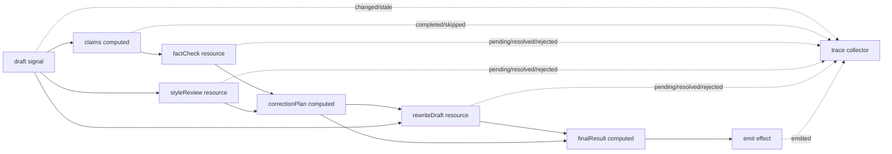
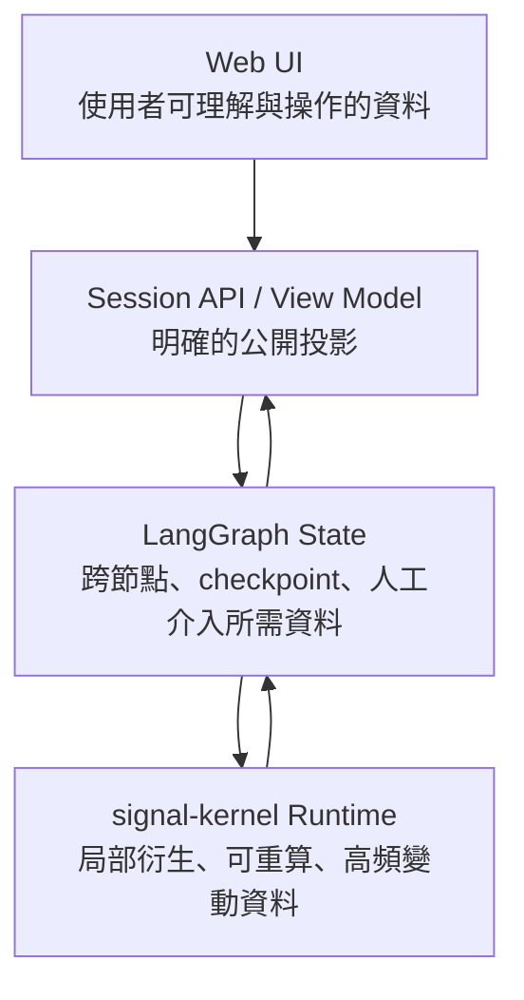

# 用 signal-kernel 在 LangGraph 節點內建立反應式修正引擎

這份文件是一篇中文技術文章草稿，用來整理 `reactive-correction-graph`
目前想證明的設計方向。它不是 README 的逐字翻譯，而是偏向未來對外講解時可以使用的版本。

## 核心問題

在 AI workflow 裡，我們常常會遇到一種情境：

1. 使用者輸入一段草稿。
2. 系統從草稿抽取 claims。
3. fact-check agent 檢查 claims。
4. style-review agent 檢查語氣與格式。
5. correction planner 根據檢查結果產生修正計畫。
6. rewrite agent 根據修正計畫重寫草稿。
7. 最後產生 final result。

這看起來像一條線性流程，但實際上不是。

如果使用者只改了 style guide，理論上不需要重新 fact-check。  
如果使用者只調整標題，但 claims 沒變，理論上也不需要重新 fact-check。  
如果 rewrite 正在 pending，系統仍然應該保留上一版穩定輸出。  
如果舊的 async result 比新的輸入晚回來，它不能覆蓋最新狀態。

這類問題的難點不在於「能不能跑一次」，而在於：

> 當狀態反覆變動、async 工作交錯完成時，系統能不能只重算必要的部分，並產生可觀測、可驗證的結果。

## 這個專案想證明什麼

這個專案的核心假設是：

> LangGraph 適合處理外層 agent workflow 編排，而 signal-kernel 適合處理單一 workflow node 內部的細粒度 reactive async dependency。

換句話說，`signal-kernel` 不是要取代 LangGraph。  
它更像是 LangGraph node 裡的一個 reactive execution engine。

分工可以這樣看：

| Layer | Responsibility |
| --- | --- |
| LangGraph | 外層 workflow 編排，控制節點、邊、狀態傳遞 |
| signal-kernel | 節點內部的 signal、computed、effect 與 async resource settling |
| LLM provider | 真實模型呼叫，例如 fact check、style review、rewrite |
| CLI | 第一階段 runtime 驗證與 trace 輸出 |
| Future UI | trace、dependency graph、snapshot 的視覺化 |

目前專案已完成最小 LangGraph integration，也能選擇性串接本機 Ollama。
不過預設測試與比較仍使用 deterministic mock model，避免把外部模型的不穩定性混進 runtime contract。

最初的 CLI 路徑先證明 runtime 行為本身穩定：

```txt
CLI
  -> invokeCorrectionRuntime()
    -> createCorrectionRuntime()
      -> signal-kernel runtime
```

目前的 LangGraph 路徑則是：

```txt
LangGraph node
  -> invokeCorrectionRuntime()
    -> createCorrectionRuntime()
      -> signal-kernel runtime
```

## Runtime Flow

目前 correction runtime 的內部流程是：


```mermaid
flowchart LR
  draft["draft signal"]
  claims["claims computed"]
  factCheck["factCheck resource"]
  styleReview["styleReview resource"]
  plan["correctionPlan computed"]
  rewrite["rewriteDraft resource"]
  final["finalResult computed"]
  effect["emit effect"]
  trace["trace collector"]

  draft --> claims
  claims --> factCheck
  draft --> styleReview
  factCheck --> plan
  styleReview --> plan
  plan --> rewrite
  draft --> rewrite
  rewrite --> final
  plan --> final
  final --> effect

  draft -. changed/stale .-> trace
  claims -. completed/skipped .-> trace
  factCheck -. pending/resolved/rejected .-> trace
  styleReview -. pending/resolved/rejected .-> trace
  rewrite -. pending/resolved/rejected .-> trace
  effect -. emitted .-> trace
```

這裡最重要的不是流程圖本身，而是每個節點的 invalidation 行為。

例如：

- draft 改變時，claims 需要重新計算。
- claims 改變時，factCheck 需要重新執行。
- styleGuide 改變時，styleReview 需要重新執行，但 factCheck 不應該重跑。
- correctionPlan 改變時，rewriteDraft 需要重跑。
- rewriteDraft pending 時，snapshot 應該保留上一版 stable final result。

這正是 reactive runtime 比純手寫 orchestration 更有價值的地方。

## SignalNode Contract

目前 runtime 對外暴露的核心 contract 是：

```ts
type SignalNode<InputState, OutputState, SnapshotState = unknown> = {
  receive(state: InputState): void;
  runUntilSettled(): Promise<void>;
  emit(): Partial<OutputState>;
  snapshot(): SnapshotState;
  trace(): TraceEvent[];
};
```

這個 contract 讓 runtime 可以被 CLI、測試、未來 LangGraph node，甚至其他 orchestrator 呼叫。

重點是外部系統不需要知道內部 signal graph 怎麼接。  
外部只需要知道：

1. 給 runtime 一個 input。
2. 等它 settle。
3. 拿 output。
4. 拿 trace。
5. 需要觀察 pending/stable 狀態時拿 snapshot。

## 為什麼需要 snapshot

`emit()` 和 `snapshot()` 的用途不一樣。

`emit()` 代表目前已經 settle 的 correction output。  
`snapshot()` 代表 runtime 當下的觀測狀態。

例如 rewrite 正在 pending 時，`emit()` 可能還不應該輸出新的 final result，因為新的 rewrite 還沒有完成。  
但外部工具仍然需要知道：

- rewriteDraft 現在是不是 pending。
- factCheck 是否 success。
- styleReview 是否 success。
- 上一版穩定 finalResult 還在不在。

所以 snapshot 的角色是：

> 提供外部工具觀測 runtime 狀態，而不需要暴露內部 signal/computed/resource 實作細節。

目前 snapshot 類型大致是：

```ts
type CorrectionRuntimeSnapshot = {
  stableFinalResult?: FinalResult;
  statuses: {
    factCheck: "idle" | "pending" | "success" | "error" | "cancelled";
    styleReview: "idle" | "pending" | "success" | "error" | "cancelled";
    rewriteDraft: "idle" | "pending" | "success" | "error" | "cancelled";
  };
};
```

這不是 React/Vue adapter。

它比較像是：

```txt
runtime adapter for orchestration and observability
```

也就是給 LangGraph、CLI inspector、debug tool、trace viewer 這類外部系統銜接用。

## correctionRuntimeAdapter 的定位

目前新增的 `correctionRuntimeAdapter` 是為了建立未來 LangGraph node 的邊界。

它的形狀很單純：

```ts
const state = await invokeCorrectionRuntime({
  draft,
  userIntent,
  styleGuide,
});
```

內部做的事情是：

```txt
createCorrectionRuntime()
runtime.receive(input)
await runtime.runUntilSettled()
return {
  ...input,
  ...runtime.emit(),
  trace: runtime.trace(),
  snapshot: runtime.snapshot()
}
```

這個 adapter 目前沒有 import LangGraph。這是刻意的。

它先證明一件事：

> correction runtime 可以被包成 plain input/output function。

未來真的接 LangGraph 時，LangGraph node 應該只是薄薄的一層 wrapper：

```ts
async function reactiveCorrectionNode(state: GraphState) {
  return invokeCorrectionRuntime(state);
}
```

這樣 LangGraph 負責外層流程，`signal-kernel` 負責節點內部的 reactive settling。

## Trace 的價值

這個專案不是只輸出 final result。它也輸出 trace。

trace 會記錄：

- `started`
- `completed`
- `changed`
- `stale`
- `pending`
- `resolved`
- `rejected`
- `skipped`
- `emitted`

這對 AI workflow 很重要，因為 AI 系統的錯誤通常不是單點錯誤，而是狀態傳遞、async timing、dependency invalidation 出問題。

如果沒有 trace，當 final result 不對時，很難回答：

- 是 claims 抽錯了嗎？
- 是 factCheck 沒重跑嗎？
- 是 styleReview 不該重跑但重跑了嗎？
- 是舊的 rewrite 結果覆蓋新的輸入嗎？
- 是某個 async resource error 但 runtime 沒有及早失敗嗎？

trace 讓這些問題變成可以測試、可以觀察、可以回放的行為。

## 目前已經驗證到哪裡

目前 TDD backlog 已經覆蓋到 Task 12。

已驗證的行為包括：

1. Basic settling  
   markdown draft 可以 settle 成 finalResult。

2. Trace lifecycle  
   trace 會記錄 changed、stale、pending、resolved、emitted。

3. Second receive  
   runtime 可以接收第二次輸入並重新 settle。

4. Style guide change  
   只改 styleGuide 時，styleReview 和 rewriteDraft 會重跑，factCheck 不會重跑。

5. Draft claim change  
   claims 改變時，factCheck、correctionPlan、rewriteDraft、finalResult 都會更新。

6. Style-only draft change  
   draft 文字改變但 claims 沒變時，可以跳過 factCheck。

7. Runtime snapshot contract  
   pending 狀態下仍可觀測 stable final result 和 resource statuses。

8. Pending rewrite keeps previous output  
   rewrite pending 時，上一版 revisedDraft 仍可讀。

9. CLI smoke test  
   CLI 可以輸出 `.output/result.md`、`.output/trace.json`、`.output/state.json`。

10. Latest receive wins  
    第二次 receive 發生後，舊 async result 不能覆蓋最新輸出。

11. Async error trace  
    async step 失敗時，runtime 會清楚 reject，trace 會記錄 rejected，snapshot 會顯示 error。

12. Adapter boundary  
    runtime 可以被包成 JSON-compatible plain state adapter，作為未來 LangGraph node 的前置邊界。

## 為什麼用 TDD 做這個專案

這個專案很適合 TDD，原因是它的錯誤常常不是肉眼看 UI 就能看出來的。

例如：

- factCheck 到底有沒有被跳過？
- 第二次 receive 後，finalResult 是不是新的？
- rewrite pending 時，上一次 stable output 是否仍存在？
- async error 是不是立刻讓 runUntilSettled 失敗？

這些都不是畫面好不好看的問題，而是 runtime 行為正不正確的問題。

所以目前採用的方式是：

```txt
Red:
  先寫一個只描述外部行為的測試。

Green:
  用最小實作讓測試通過。

Refactor:
  綠燈後再整理結構。
```

測試只透過公開介面驗證：

- `createCorrectionRuntime()`
- `runtime.receive()`
- `runtime.runUntilSettled()`
- `runtime.emit()`
- `runtime.trace()`
- `runtime.snapshot()`
- `invokeCorrectionRuntime()`
- CLI command

避免測試綁死內部 computed/resource 的實作細節。

## 這個專案目前還沒有做什麼

目前還沒有做：

- React adapter
- Vue adapter
- Next.js UI
- RAG
- database
- multi-agent system
- production deployment

這些不是做不到，而是還不是第一階段該做的事。

目前最重要的是先把 runtime contract 穩住。

## 已完成的 LangGraph minimal proof of concept

目前已完成的最小整合包含：

1. 加入 LangGraph dependency。
2. 建立 GraphState。
3. 建立 `prepareInputNode`。
4. 建立 `reactiveCorrectionNode`，內部呼叫 `invokeCorrectionRuntime()`。
5. 建立 `finalizeNode`。
6. 驗證 graph 可以跑完並產生 final state、trace 與 snapshot。

最小 LangGraph 流程可以先長這樣：

```txt
START
  -> prepareInput
  -> reactiveCorrectionNode
  -> finalize
  -> END
```

重點不是把 LangGraph 用得很複雜。  
重點是證明：

> LangGraph 可以把 correction runtime 當成一個普通 node，而 signal-kernel 可以在 node 內部處理更細的 reactive async dependency。

## 對外文章可以怎麼定位

如果未來要寫成中文技術文章，可以用這樣的主軸：

> 我不是要重做 LangGraph，而是想探索：當一個 LangGraph node 內部變得高度動態時，能不能用 signal-kernel 管理細粒度 async dependency。

文章可以分成三篇：

### 第一篇：為什麼 AI workflow node 裡需要 reactive runtime

重點講問題：

- AI workflow 不是單純線性流程。
- async source 會交錯完成。
- 局部 invalidation 很難手寫。
- trace 對 debug 很重要。

### 第二篇：用 signal-kernel 做 correction runtime

重點講實作：

- signal、computed、resource、effect 的分工。
- draft -> claims -> factCheck/styleReview -> correctionPlan -> rewrite -> finalResult。
- snapshot 與 trace。
- TDD 怎麼驗證 runtime 行為。

### 第三篇：把 reactive runtime 包成 LangGraph node

重點講整合：

- LangGraph 負責外層 orchestration。
- signal-kernel 負責 node 內部 reactive settling。
- adapter boundary 為什麼先不 import LangGraph。
- 未來如何加真實 LLM。

## 總結

目前這個專案已經證明：

> signal-kernel 可以在 CLI demo 裡管理一個具備 async resource、局部 invalidation、trace、snapshot、error handling 的 correction runtime。

目前已證明：

> 這個 runtime 可以被 LangGraph 當成普通 node 呼叫，並把 correction output、trace、snapshot 回傳成 graph state。

這個定位很重要。

它不是前端 UI adapter，也不是要取代 LangGraph。  
它是一個面向 workflow engine 的 reactive runtime adapter，目標是讓複雜 async dependency 在單一 node 內部變得可觀測、可測試、可組合。
## 本機 LLM Demo 紀錄

在 Task 15 之後，runtime 已經可以透過 `CorrectionRuntimeModel` 介面切換 provider。預設測試仍然使用 deterministic mock model；Ollama 只作為手動 demo provider。

這次實測得到兩個重要觀察：

1. `qwen3:4b` 可以被 Ollama 呼叫到，但在 `factCheckClaims` 的 JSON step 回傳空字串，最後 runtime 會明確失敗：

```txt
factCheck failed: Ollama factCheckClaims returned an empty response for model qwen3:4b
```

這代表問題不是 runtime 沒有 settle，也不是 Ollama 沒有啟動，而是本機模型在 structured JSON output 上不穩定。

2. 改用 `llama3.2:3b` 後，手動 demo 可以成功輸出：

```bash
OLLAMA_MODEL=llama3.2:3b pnpm run demo:ollama ./src/examples/input.md
```

成功後會產生：

```txt
.output/result.md
.output/trace.json
.output/state.json
```

這證明 local LLM provider path 已經接通，並且 `draft -> claims -> factCheck -> styleReview -> correctionPlan -> rewriteDraft -> finalResult` 的 runtime lifecycle 可以跑完。

不過這次也暴露一個更細的品質問題：`state.json` 裡的 `claims` 有三個，但 `factCheckResult.items` 只回了一個。也就是說，demo 在技術上跑通了，但 provider output 還沒有達到「每個 claim 都被 fact-check 覆蓋」的語意品質。

因此後續任務切成兩段：

### Task 16: Missing FactCheck Coverage

處理「LLM 回傳不完整但仍可使用」的情況。

目標是：

- 如果 runtime 抽出多個 claims。
- 但 provider 只回部分 claim 的 fact-check result。
- runtime 不應該默默當作完全成功。
- 缺漏的 claim 應該被補成 `needs-review`。
- `finalResult.unresolvedIssues` 應該揭露這些 missing coverage。

這讓 demo 的語意品質更可信：即使本機模型沒有完整照 contract 回答，runtime 也能把缺口變成可觀察的 unresolved issue。

### Task 17: Provider Output Hardening

處理「LLM 回傳錯誤或無法使用」的情況。

包含：

- unknown `claimId`
- empty JSON response
- invalid JSON response
- provider error message 是否清楚
- trace 是否有 `resource rejected`
- hard failure 時是否避免 emit misleading `finalResult`

Task 16 和 Task 17 的分界是：

```txt
Task 16: incomplete but usable output
Task 17: invalid or unusable output
```

這個切法可以讓 TDD 節奏保持小步前進，也能把本機 LLM 的不穩定性慢慢收斂成 runtime contract。

## Task 18：把 provider normalization 寫進 trace

Task 16 與 Task 17 已經讓不完整或錯誤的 provider output 不會默默污染 final result，
但如果只有修正後的 state，開發者仍然看不出 runtime 曾經替 provider 補了什麼、丟掉了什麼。

Task 18 因此沒有再改 `finalResult` contract，而是把兩種 safety decision 記錄到 trace：

```ts
traceCollector.changed("resource", "factCheckCoverage", {
  claimId: claim.id,
  reason: "missing provider result normalized",
});

traceCollector.skipped("resource", "factCheckCoverage", {
  claimId: item.claimId,
  reason: "unknown claim id ignored",
});
```

這裡刻意使用不同 event type：

- `changed` 表示 runtime 為缺漏 claim 建立了新的 `needs-review` item。
- `skipped` 表示 provider 回傳的 unknown `claimId` 沒有進入有效 state。

兩種事件都帶有 `claimId`，因此 CLI、測試或未來 trace viewer 可以指出是哪一筆資料被處理。
自動化測試則分別注入 missing coverage 與 `claim-999`，確認 trace 可觀測，但
`factCheckResult.items` 與 `finalResult` 仍維持 Task 16、17 定義的行為。

## Task 19：把隱含的 claim slice 變成 claim budget

unknown `claimId` 是 provider 回傳了不屬於輸入的資料；claim budget 則是 runtime
在呼叫 provider 前，主動限制要檢查的 claim 數量。兩者不能混為一談。

目前 runtime 使用明確常數：

```ts
const DEFAULT_CLAIM_BUDGET = 6;
```

實作先抽出所有候選 claims，再套用 budget。只有真的發生截斷時才寫 trace：

```ts
traceCollector.skipped("computed", "claimBudget", {
  budget: 6,
  candidateCount,
  extractedCount,
  omittedCount,
  factCheckScope: "extractedClaims",
});
```

`factCheckScope: "extractedClaims"` 是這個 contract 的重點：coverage 只針對 state
裡實際抽出的 claims 計算，不代表全文所有候選句子都已被 fact-check。

TDD 使用八個候選句子的 draft，驗證最後只留下六個 claims、provider 也只收到這六筆，
並且 trace 明確記錄另外兩筆是因 budget 被省略，而不是 provider 漏答。

## Task 20：建立可直接執行的 LangGraph CLI path

runtime hardening 完成後，Task 20 才把相同行為放進可見的 LangGraph demo：

```bash
pnpm run demo:graph ./src/examples/input.md
```

CLI 的 `--mode graph` 分支會建立 `createCorrectionGraph()`，而不是直接呼叫
`createCorrectionRuntime()`。Graph 本身保持很小：

```txt
START
  -> prepareInput
  -> reactiveCorrection
  -> finalize
  -> END
```

三個 graph node 的責任是：

- `prepareInput`：整理輸入並記錄 graph lifecycle。
- `reactiveCorrection`：把 state 轉成 runtime input，呼叫 `invokeCorrectionRuntime()`。
- `finalize`：標記 graph 已完成。

輸出刻意保留兩條 observability stream：

- `graphTrace` 記錄 `prepareInput`、`reactiveCorrection`、`finalize` 的 started/completed。
- `trace` 保留 signal-kernel runtime 的 changed/stale/pending/resolved/emitted。

graph event 不會混進 runtime trace，runtime event 也不會偽裝成 graph event。
CLI smoke test會同時驗證 `result.md`、`state.json` 與 `trace.json`。

## Task 21：把 input fixture 改成能講故事的案例

早期 input 只要能跑通即可，但技術文章需要一眼就能看出三種 correction signal。
因此 `src/examples/input.md` 的 JSON front matter 明確提供：

```json
{
  "userIntent": "Explain why reactive invalidation avoids unnecessary agent work.",
  "styleGuide": "Use concise technical language for TypeScript developers."
}
```

draft 內另外包含帶有 `maybe` 的 tentative claim。deterministic mock 因此會穩定產生：

- fact-check action：tentative claim 需要 review。
- style action：套用 TypeScript developer 的簡潔技術語氣。
- intent action：保留「解釋 reactive invalidation」的目的。

這讓 `result.md`、`state.json` 和 `trace.json` 適合拿來做文章截圖或逐步解說，
而不是只能證明「程式沒有 throw」。

## Task 22：LangGraph 與 Ollama 的手動整合

Task 20 的 graph path 預設仍使用 mock。Task 22 讓相同 CLI path 可以選擇 Ollama：

```bash
OLLAMA_MODEL=llama3.2:3b pnpm run demo:graph --provider ollama ./src/examples/input.md
```

provider selection 仍然發生在 graph 外面：

```txt
CLI
  -> createCorrectionModelFromEnv()
  -> createCorrectionGraph({ model })
  -> invokeCorrectionRuntime({ model })
```

因此 LangGraph node 與 runtime core 都不需要 import Ollama-specific code。
Ollama path 使用較長的 settle timeout，provider 的 empty response、invalid JSON 或 HTTP error
仍會沿用 runtime 的 rejected/error trace contract。

這條路徑被明確定義為 manual demo：正常 `pnpm test` 與 CI 不要求安裝 Ollama，
也不要求任何 cloud API key。

## Task 23：讓 runtime 活過多次 graph invocation

只把 runtime 包成 LangGraph node 還不等於 reactive reuse。原本 adapter 每次 invocation
都建立新的 runtime，因此下一次更新無法利用前一次已 settle 的 fact-check。

Task 23 先讓 adapter 接受 caller-owned runtime：

```ts
type CorrectionRuntimeAdapterOptions = CorrectionRuntimeOptions & {
  runtime?: CorrectionRuntime;
};
```

adapter 仍然只回傳 plain state：

```ts
const runtime = existingRuntime ?? createCorrectionRuntime(runtimeOptions);

runtime.receive(input);
await runtime.runUntilSettled();

return {
  ...input,
  ...runtime.emit(),
  trace: runtime.trace(),
  snapshot: runtime.snapshot(),
};
```

接著由明確的 in-process session boundary 擁有 live runtime：

```ts
function createCorrectionGraphSession(options) {
  const runtime = createCorrectionRuntime(options);
  return createCorrectionGraph({ runtime });
}
```

這個 ownership boundary 很重要：

- live signal graph 留在 session closure 裡。
- LangGraph state 只包含 JSON-compatible output、trace 與 snapshot。
- runtime object 不會被塞進 checkpoint 或輸出 artifact。
- 不需要 database 或 LangGraph checkpointer。

測試會先 invoke initial draft，再對同一 session 做 style-only update。第二段新增 trace
包含 `styleReview pending` 與 `rewriteDraft pending`，但沒有 `factCheck pending/stale`。
第三次改變 claims 時，trace 才重新出現 `factCheck pending`，final draft 也會更新。

最後再建立 session A 與 session B，確認兩者的 receive count、draft、summary 與 trace history
完全隔離。也就是說，reuse 發生在同一個明確 session 內，而不是全域共享。

## Task 24：用 instrumented model 比較 eager 與 reactive

完成 persistent session 後，才有辦法回答「reactive runtime 到底省了哪些工作」。
Task 24 沒有先做 wall-clock benchmark，而是用相同的 deterministic mock model 加上一層計數器：

```ts
type CorrectionOperationCounts = {
  factCheckCalls: number;
  styleReviewCalls: number;
  rewriteDraftCalls: number;
};
```

比較的兩條路徑是：

- eager baseline：重用同一個 compiled graph，但每次 invocation 都由 adapter 建立 fresh runtime。
- reactive path：三次更新都使用同一個 `createCorrectionGraphSession()`。

兩者依序處理相同的 initial input、style-only update、claim-changing update，
並比較 provider call counts、是否產生 final result，以及兩邊的 final result 是否相同。

### Task 24g：避免 pending 期間使用 stale upstream result 重寫

第一版 comparison 發現 reactive fact-check 確實有省下來，但 rewrite 次數反而被放大：

```txt
style-only reactive rewriteDraft: 3
claim-changing reactive rewriteDraft: 6
```

原因是 async resource 為了保留 stable output，使用 `keepPreviousValueOnPending`。
前一輪 fact-check/style-review value 仍可讀時，correction plan 曾短暫把 stale value 當成當前結果，
先啟動一次 rewrite，等新結果回來後又重寫一次。

修正不是拿掉 previous stable output，而是替 async result 加上 input identity：

```ts
type KeyedResourceResult<T> = {
  inputKey: string;
  value: T;
};
```

`correctionPlanComputed` 除了要求 resource status 為 success，也會比較：

```txt
factCheck result inputKey === current claims inputKey
styleReview result inputKey === current draft/styleGuide inputKey
```

只有兩個 upstream result 都屬於 current receive，才允許建立 plan。
rewrite result 另外攜帶 `epoch` 與 `planKey`，`finalResultComputed` 也只接受 current epoch
和 current plan 的結果。

這樣可以同時保留兩個看似衝突的需求：

- pending 時，`snapshot().stableFinalResult` 仍可讀到上一版穩定輸出。
- stale upstream value 不會替新的 receive 啟動額外 model rewrite。

修正後 style-only 與 claim-changing 的 reactive rewrite 累積次數分別回到 `2` 與 `3`，
同時保持 eager/reactive final results 相同。下一節就是這份 comparison 的可重現輸出。

## Task 24 / 26：可重現的 deterministic comparison

目前可以用以下命令重現 eager LangGraph 與 persistent reactive session 的比較：

```bash
pnpm run demo:compare
```

### 代表性命令輸出

以下內容來自目前版本的實際執行：

```txt
Observed provider call counts:
- style-only; factCheck eager=2 reactive=1; styleReview eager=2 reactive=2; rewriteDraft eager=2 reactive=2
- claim-changing; factCheck eager=3 reactive=2; styleReview eager=3 reactive=3; rewriteDraft eager=3 reactive=3

Recompute savings by update:
- style-only; factCheck avoided=1 reused=1 superseded=0; styleReview avoided=0 reused=0 superseded=0; rewriteDraft avoided=0 reused=0 superseded=0
- claim-changing; factCheck avoided=0 reused=0 superseded=0; styleReview avoided=0 reused=0 superseded=0; rewriteDraft avoided=0 reused=0 superseded=0

These deterministic fixture counts are not a general performance benchmark.

Output written to:
- ./.output/result.md
- ./.output/state.json
- ./.output/trace.json
- ./.output/comparison.json
- ./.output/savings.json
- ./.output/execution-summary.json
- ./.output/manifest.json
```

這些數字是累積 call counts：

- `style-only` 包含 initial receive 與 style-guide receive。
- `claim-changing` 再包含一次會改變 claims 的 draft receive。
- 兩個 scenario 的 `finalResultsMatch` 都是 `true`。

在這兩個固定案例裡，persistent reactive session 都比 fresh eager graph 少一次 fact-check。
style-only 更新沒有讓 fact-check 失效；claim-changing 更新則確實重新執行 fact-check。

### Style-only trace 摘錄

以下事件來自第二次 receive。完整的 `trace-41` 到 `trace-76` 區段沒有
`factCheck stale` 或 `factCheck pending`，但 style review 與 final result 會繼續更新：

```json
[
  { "id": "trace-41", "scope": "runtime", "type": "started", "label": "receive" },
  { "id": "trace-42", "scope": "signal", "type": "changed", "label": "styleGuide" },
  { "id": "trace-43", "scope": "resource", "type": "stale", "label": "styleReview" },
  { "id": "trace-60", "scope": "resource", "type": "pending", "label": "styleReview", "metadata": { "token": 2 } },
  { "id": "trace-71", "scope": "resource", "type": "resolved", "label": "styleReview", "metadata": { "token": 2 } },
  { "id": "trace-74", "scope": "effect", "type": "emitted", "label": "finalResult", "metadata": { "unresolvedCount": 0 } }
]
```

### Claim-changing trace 摘錄

第三次 receive 改變 draft 與 claims，因此 trace 明確記錄 fact-check invalidation 與新工作：

```json
[
  { "id": "trace-77", "scope": "runtime", "type": "started", "label": "receive" },
  { "id": "trace-78", "scope": "signal", "type": "changed", "label": "draft", "metadata": { "length": 91 } },
  { "id": "trace-79", "scope": "computed", "type": "stale", "label": "claims" },
  { "id": "trace-80", "scope": "resource", "type": "stale", "label": "factCheck" },
  { "id": "trace-92", "scope": "computed", "type": "completed", "label": "claims", "metadata": { "count": 2 } },
  { "id": "trace-93", "scope": "resource", "type": "pending", "label": "factCheck", "metadata": { "token": 2 } },
  { "id": "trace-113", "scope": "resource", "type": "resolved", "label": "factCheck", "metadata": { "token": 2 } },
  { "id": "trace-123", "scope": "effect", "type": "emitted", "label": "finalResult", "metadata": { "unresolvedCount": 0 } }
]
```

事件 ID 與 token 是這次 deterministic run 的代表性摘錄；對外文章真正應該強調的是
`changed -> stale -> pending -> resolved -> emitted` 的語意，以及 style-only 區段沒有產生新的 fact-check work。

### 這份比較不能證明什麼

這不是 latency、token、成本或 production scalability benchmark。
它也不能證明 deterministic final result 在事實或文字品質上一定正確，更不能證明
LangGraph 無法透過 caching、checkpointing 或其他 workflow 設計達成 reuse。
目前能支持的結論只有：在這兩個固定 transition 中，signal-kernel runtime 的局部
invalidation 會避免不必要的 fact-check，同時保留相同的 deterministic output。

## Task 27-29：執行證據不等於答案正確

Task 27 先把累積 trace 投影成 receive-scoped execution summary。每次 receive 都有
穩定的 `receiveEpoch`，summary 會分開列出：

```txt
recomputed
reused
superseded
emitted
```

這讓 style-only update 可以被描述成「重用 fact-check，只重算 style review 與 rewrite」，
而 claim-changing update 則會明確重新執行 fact-check。尚未完成就被新 receive 取代的工作
會進入 `superseded`，不會偽裝成成功重用。

Task 28 再把兩種不同來源的 evidence 組合起來：

- instrumented model 提供真實 provider call counts。
- execution summary 提供 reused 與 superseded evidence。

`avoidedCalls` 只在 fixture、model contract 與 update order 相同時，使用以下公式：

```txt
avoidedCalls = eagerCalls - reactiveCalls
```

而且必須計算單次 update 的 delta。`claim-changing` 的累積 fact-check counts 是 `3 vs 2`，
但扣除上一個 style-only scenario 後，本次 update 是 `1 vs 1`，所以 avoided calls 是 `0`，
不能把先前已省下的工作重複宣稱一次。

Task 29 則建立 versioned structural reliability scorecard。初版權重是：

| Dimension | Weight |
| --- | ---: |
| Runtime settlement rate | 30 |
| Claim coverage | 25 |
| Unknown-ID containment | 15 |
| Stale-result protection | 20 |
| Session isolation | 10 |

另外有三個 hard gates：stale result overwrite、錯誤或缺失的 successful final result、
以及跨 session state leak。任何 hard gate failed，都會讓 verdict 成為 `fail`，即使 weighted
score 仍然很高。缺少必要 evidence 時，score 是 `null`，verdict 是
`insufficient-evidence`，不會把沒有測到的項目當成通過。

### 五種 evidence 要分開看

| Evidence | 可以支持的結論 | 不能證明的事情 |
| --- | --- | --- |
| Avoided/reused/superseded counts | 固定 transition 下的執行效率 | 事實正確或文字品質 |
| Structural reliability | Runtime settlement、coverage、stale safety、session isolation | Provider 可攜性或答案正確性 |
| Provider compatibility | 某個 model/provider 遵守 runtime contract 的比例 | 被接受內容的準確度 |
| 重複 verification attempts | 系統刻意做了多少驗證工作 | 驗證彼此獨立或結論為真 |
| Subjective correction quality | 未來 evaluator 的預留邊界 | 值為 `not-evaluated` 時不能下任何品質結論 |

這裡最容易混淆的是「多執行一次」。如果同一個 fact check 因失效傳播被意外重跑，
它是 recomputation waste；如果系統刻意請另一個 verifier 使用不同 evidence source 交叉檢查，
它才可能是 corroboration。即使如此，多次同意仍不是事實真值。未來 benchmark 必須另外記錄
verifier identity、evidence source、agreement 與 disagreement，不能只把 call count 乘上權重。

因此目前 scorecard 會把 execution efficiency、provider compatibility、structural reliability
分開輸出，`subjectiveCorrectionQuality` 維持 `not-evaluated`。這個限制不是缺點，而是避免
工具用看似精確的分數宣稱它其實沒有測量的事情。

## Task 30：用 versioned artifact bundle 穩定對外邊界

前面的 CLI 已經會輸出 result、state、trace、comparison、savings、evaluation 與 scorecard，
但如果外部工具只看到一個資料夾，它無法知道哪些檔案屬於同一次 run、schema 是否相容，
也無法區分「這次沒有產生」與「檔案遺失」。Task 30 因此加入 `.output/manifest.json`：

```ts
type ArtifactBundleManifest = {
  schemaVersion: 1;
  run: {
    id: string;
    generatedAt: string;
    command: string;
    mode: string;
    provider: "deterministic-mock" | "ollama";
  };
  artifacts: {
    result: ArtifactReference | null;
    state: ArtifactReference | null;
    trace: ArtifactReference | null;
    executionSummary: ArtifactReference | null;
    comparison: ArtifactReference | null;
    savings: ArtifactReference | null;
    evaluation: ArtifactReference | null;
    scorecard: ArtifactReference | null;
    report: ArtifactReference | null;
  };
};
```

每個 JSON artifact 都帶有 schema name 與 version；沒有產生的 optional artifact 明確寫成
`null`。validator 會拒絕未知 bundle version、不相容 media type、缺少必要 artifact，
以及可能離開 bundle directory 的路徑。clock 與 run ID 由測試注入，讓 manifest assertions
保持 deterministic。

這一層的重要性不只在於方便讀檔。它把 live runtime 與 serialized evidence 明確切開：
signal graph、effect、AbortController 或 LangGraph runnable 都不能進入 artifact；外部 consumer
只依賴可版本化的資料 contract。後續 report 與 Web 因此不需要 import runtime internals。

## Task 31：從 artifact 產生靜態 evidence report

Task 31 把 versioned bundle 投影成 report view model，再輸出 self-contained HTML：

```bash
pnpm run demo:report
```

產出的 `.output/report.html` 不需要 server、database、Ollama、LangSmith 或前端 framework。
report 首先呈現 eager 與 reactive 的 operation counts，再依 receive 顯示：

```txt
recomputed
reused
superseded
emitted
```

Reliability 區塊仍保留 structural verdict、hard gates、provider compatibility 與
`subjectiveCorrectionQuality: not-evaluated`。也就是說，report 的工作是把 evidence 說清楚，
不是把所有數字壓成一個看似客觀的總分。

HTML renderer 使用 semantic headings、tables、lists 與 skip link。Playwright 會在 desktop
與 mobile viewport 驗證內容可讀、鍵盤可以直接跳到主內容、文字不會溢出。因為 report
只讀 manifest 與 artifacts，它也適合放在 CI artifact、GitHub Pages 或技術文章附件中。

## Task 32：在 framework-agnostic session API 上建立 Web Demo

靜態 report 能解釋一次已完成的 run，但無法讓開發者親自修改輸入，觀察第二次 receive
到底重用了什麼。Task 32 因此加入 local interactive session：

```txt
Vanilla Web UI
  -> Node HTTP session API
  -> LangGraph session boundary
  -> signal-kernel correction runtime
```

HTTP server 使用 Node `node:http`，不依賴 React、Vue、Next.js 或 database。API 提供：

- `POST /api/sessions`：建立一個擁有 live runtime 的 session。
- `POST /api/sessions/:id/invocations`：對同一 session 送入下一次 input。
- `POST /api/sessions/:id/reset`：以 fresh runtime 重設 session。
- `DELETE /api/sessions/:id`：釋放 session ownership。

回應不是 raw graph state，而是 versioned session view model。Web UI 目前用原生 HTML、CSS、
JavaScript 呈現 draft、result 與 execution activity。送出期間保留上一版 stable result，
並顯示 pending work；settled 後再分欄顯示 recomputed、reused 與 superseded。Browser tests
會連續送出 initial、style-only、claim-changing update，確認 receive epoch 依序增加；另外開啟
兩個頁面，確認 session state 與 trace 不會交叉污染。

### Web UI、LangGraph state 與 runtime state 不是同一層

這裡需要特別記錄一個容易混淆的觀念：資料存在 LangGraph 或 runtime，不代表應該直接顯示
在一般使用者介面。比較穩定的分層是：


```mermaid
flowchart TD
  web["Web UI<br/>使用者可理解與操作的資料"]
  api["Session API / View Model<br/>明確的公開投影"]
  db["LangGraph State<br/>跨節點、checkpoint、人工介入所需資料"]
  runtime["signal-kernel Runtime<br/>局部衍生、可重算、高頻變動資料"]

  web --> api
  api --> db
  db --> runtime
  runtime --> db
  db --> api
```

目前資料可以這樣判斷：

| 資料 | 主要位置 | 一般 UI 建議 |
| --- | --- | --- |
| Draft | LangGraph state 與 runtime input | 顯示並允許編輯 |
| User intent | LangGraph state 與 runtime signal | 視產品需要顯示，或收進進階設定 |
| Claims | runtime computed；必要時投影到 graph state | 預設隱藏，Developer Inspector 可唯讀顯示 |
| Fact-check result | runtime resource；摘要可進 graph state | 顯示結論與 unresolved issues，不必暴露所有內部狀態 |
| Trace / snapshot | runtime 與 backend artifact | 放在 Developer Inspector 或下載 artifact |
| Final result | LangGraph state 與 session view model | 顯示 |

是否把 runtime data 提升到 LangGraph state，可以用四個問題判斷：後續 node 是否需要、
checkpoint 恢復是否需要、是否需要人工審核、是否值得持久化而不是重新計算。如果答案都是否，
資料留在 signal-kernel runtime 即可。

以 claims 為例，它原本只是 draft 的衍生資料，留在 runtime 最自然；如果未來增加
human-in-the-loop claim review，或另一個 LangGraph node 要使用 claims，它才需要提升成
共享 graph state。Intent 也不一定要成為可見欄位：若由使用者明確指定就顯示；若由 agent
從對話推斷，就留在後台，只在 developer mode 顯示。

目前 Web Demo 顯示 `User intent` 是為了方便測試 reactive invalidation，不代表正式工具必須
把 agent internals 全部暴露。更適合 developer tool 的做法是提供兩種視圖：一般模式只顯示
輸入、結果與簡單摘要；Developer Inspector 再展開 claims、attempts、trace、reused 與
recomputed。Trace 也應優先記錄 ID、狀態與數量，避免不必要地複製敏感原文。

## Task 33：把 corroboration 與 recomputation 分成兩種證據

前面的 comparison 證明「避免重算」有價值，但不能反過來推論「多執行幾次就更可靠」。
Task 33 將兩個概念拆開：

```txt
reactive recomputation
  = 因依賴失效而再次執行工作

verification attempt
  = 系統刻意要求 verifier 檢查 claim
```

Verifier contract 先記錄 configured identity：

```ts
type VerifierIdentity = {
  verifierId: string;
  provider: string;
  model: string;
};

type VerificationAttemptPurpose = "primary" | "corroboration";
```

`verifierId` 不等於獨立來源。兩個不同 ID 如果使用相同 provider/model，會得到相同 model key，
預設不能被描述成兩份獨立 corroboration。每個 attempt 另外保留 verdict、note 與
`evidenceReferences`；沒有外部來源時，references 維持空陣列，不把模型回答冒充事實證據。

`corroborateClaim()` 會保留三種 outcome：

| Outcome | 意義 |
| --- | --- |
| `agreement` | 足夠數量的 model identities 回傳相同 conclusive verdict |
| `disagreement` | conclusive verdict 不一致，所有 attempts 都保留 |
| `insufficient-evidence` | verifier 主動回報不足、共享同一 model identity，或 quorum 未達標 |

Quorum policy 也是 versioned contract：

```ts
type CorroborationQuorumPolicy = {
  policyVersion: 1;
  minimumIndependentModels: number;
};
```

明確提供 policy 時，結果會記錄 required policy 與 observed model count。這裡的
`independentModels` 只代表不同 provider/model identity，不代表訓練資料、推理偏誤或外部來源
在統計上真正獨立，因此 agreement 仍不能被寫成 factual truth。

Task 33e 再把 evidence 分別投影到三層：

- Trace 使用獨立的 `verification` scope，記錄 verification attempts 與 corroboration outcome，
  不混入 `resource/factCheck` 的 stale、pending、resolved 生命週期。
- Scorecard 分開輸出 `verificationAttempts` 與 `recomputationCalls`，兩者都不會偷偷增加
  structural reliability score。
- Report view model 使用 verification 與 recomputation 兩個平行區塊，讓 UI 或文章不會把
  「刻意多查一次」和「因失效而重跑一次」合併成同一個數字。

最後加入 optional manual Ollama path：

```powershell
$env:OLLAMA_CORROBORATION_MODELS = "llama3.2:3b,qwen3:4b"
$env:CORROBORATION_MINIMUM_MODELS = "2"
pnpm run evaluate:corroboration -- "Signal-kernel tracks reactive dependencies."
```

命令會寫入 `.output/corroboration.json`，內容包含 versioned report、claim、attempts、quorum、
outcome 與 verification trace。正常 test suite 仍使用 deterministic verifier doubles，不要求
Ollama、API key 或網路連線；真實多模型路徑只在開發者明確執行命令時啟動。

Task 33 的核心不是用多數決製造「真相分數」，而是讓系統誠實回答：做了幾次刻意驗證、
由哪些 verifier 執行、是否真的使用不同 model identity、彼此同意或衝突，以及目前還缺少
哪些外部 evidence。這個邊界能讓未來的 benchmark 繼續成長，而不會把執行次數誤包裝成可靠性。

## Task 34：Live runtime event stream

Task 34 把前面已經存在的 runtime trace，推進成可以即時觀察的 local event stream。
這一步不是新增另一套追蹤語意，而是把同一份 TraceEvent 在 runtime 還沒 settle 前先投影給
developer tool 使用。

目前 local web server 提供：

```txt
GET /api/sessions/:id/events
```

這個 endpoint 使用 Server-Sent Events。每筆 message 是 `LiveTraceEvent`：

```ts
type LiveTraceEvent = {
  schemaVersion: 1;
  sequence: number;
  event: TraceEvent;
};
```

`sequence` 是每個 session stream 內單調遞增的順序；`event` 則是 runtime 最後會進入
`trace.json` 的同一份 TraceEvent payload。也就是說，live stream 可以讓 UI 在 invocation
response 回來前顯示 `styleReview pending`、`rewriteDraft pending` 這類狀態，但它不是新的 truth source。

這裡的邊界可以這樣理解：

| Layer | 用途 | 是否 durable |
| --- | --- | --- |
| Live SSE events | 執行中的 developer feedback | 否，session 關閉後即消失 |
| `trace.json` | 已 settle 的 runtime lifecycle artifact | 是，可被 report 與測試讀取 |
| `manifest.json` / artifact bundle | 版本化列出同一次 run 的可相容輸出檔 | 是，給離線 consumer 使用 |

Task 34a 先定義 `LiveTraceEvent` contract，並讓 graph session 可以 `subscribe()`。
Task 34b 確認 live subscriber 即使修改收到的 payload，也不會污染 settled `runtime.trace()`。
Task 34c 驗證 unsubscribe cleanup 與 session isolation：兩個 session 的 live stream 各自從
sequence 1 開始，不會互相串流污染。Task 34d 把 session subscription 接成 local SSE endpoint。
Task 34e 再讓 vanilla Web UI 使用 EventSource；第二次 style-only update 時，final result
還沒回來前，畫面只會顯示真正 pending 的 `Style review`，不會把已 reuse 的 `Fact check`
誤顯示成 pending。

這個設計也延續 Task 30 的 artifact 邊界：live stream 不會進入 artifact bundle。
`.output/manifest.json` 只記錄可序列化、可版本化的結果，例如 `result.md`、`state.json`、
`trace.json`、`comparison.json`、`evaluation.json`、`scorecard.json` 或 `report.html`。
runtime instance、signal graph、AbortController、EventSource connection 都不能進入 bundle。

因此 Task 34 的定位是：

```txt
live events = runtime 執行中的觀察投影
trace.json = runtime settle 後的生命週期證據
artifact bundle = 離線工具、report、CI artifact 的版本化入口
```

三者描述的是同一條 runtime lifecycle，但生命週期與使用場景不同。這個分層讓 Web Inspector
可以即時顯示正在跑的工作，同時保留 CLI artifact 的可重現性與離線可讀性。

## Task 35：Developer Inspector View Model

Task 35 的重點是把前面累積的 trace、artifact bundle、execution summary、verification
evidence 整理成一個 developer 可以理解的 inspector view model。這裡刻意沒有做成 React
或 Vue adapter，因為目前更重要的是定義一個 framework-neutral 的資料投影：

```txt
live session snapshot / saved artifact bundle
  -> developer inspector view model
  -> vanilla web rendering / future editor panel / future external tool
```

這一步的設計邊界是：

| 資料 | 預設使用者結果 | Developer Inspector |
| --- | --- | --- |
| revised draft | 顯示 | 顯示 |
| correction summary | 顯示 | 顯示 |
| claims | 隱藏 | 唯讀顯示 |
| user intent | 視產品需要 | 顯示來源與目前值 |
| runtime trace | 隱藏 | 依 receive 分組 |
| recomputed / reused / superseded | 隱藏 | 顯示 |
| verification / corroboration | 摘要或隱藏 | 與 recomputation 分開顯示 |
| missing artifact warning | 必要時顯示 | 顯示明確診斷 |

這個分層是為了避免把 agent runtime 的內部資料全部丟到一般 UI。一般使用者需要知道的是
「結果是什麼、還有哪些 unresolved issues」；開發者才需要看「為什麼這次 style-only update
沒有重跑 fact check」、「哪一個 receive 產生了 pending / resolved」、「哪些 artifact 缺失導致
inspector 無法完整還原」。

Task 35a 先從 artifact bundle 建立 inspector view model，讓 `.output/manifest.json`、
`trace.json`、`state.json`、`comparison.json` 等離線輸出可以被同一套 contract 讀取。
Task 35b 把 execution summary 投影成 receive-level groups，例如：

```txt
receive 1
  recomputed: factCheck, styleReview, rewriteDraft
  emitted: finalResult

receive 2
  reused: factCheck
  recomputed: styleReview, rewriteDraft
  emitted: finalResult
```

Task 35c 加上 developer-only 的 claims、intent 與 evidence sections，並保留 Task 33 建立的
邊界：verification attempts 不等於 reactive recomputation calls。Task 35d 則讓同一套 view
model 可以從 live session snapshot 建立，而不是只能讀 artifact bundle。

Task 35e 把 inspector 接進 local web demo，但仍然只使用 vanilla HTML/CSS/JavaScript。這裡的
目的不是建立正式產品 UI，而是證明：

```txt
runtime evidence 可以被框架無關地投影成可讀畫面
```

Task 35f 再用 browser tests 驗證三種情境：

1. empty inspector data 不會造成 broken UI。
2. successful session 會顯示 result、trace、claims、execution groups。
3. partially missing artifact 會顯示 warning，而不是讓 inspector 假裝資料完整。

到這裡，CLI artifact 與 web inspector 開始形成同一條觀測鏈：

```txt
runtime trace
  -> settled artifact
  -> inspector view model
  -> local developer UI
```

這對後續推廣很重要，因為「減少重算」本身是底層機制；inspector 讓這個底層機制變成可被看見、
可被教學、可被 debug 的行為。

## Task 36：Headless Correction Session SDK

Task 36 把 CLI、web、未來 LangGraph node 需要共用的 runtime orchestration 收斂成一個
headless session SDK。這一步很關鍵，因為如果 CLI、web、LangGraph 各自直接操作
`createCorrectionRuntime()`，後續很容易長出三套 receive / settle / emit / trace / reset 的邏輯。

新的邊界是：

```ts
session.receive(input)
session.runUntilSettled()
session.emit()
session.snapshot()
session.subscribe(listener)
session.reset()
session.dispose()
```

依賴方向變成：

```txt
CLI
  -> createCorrectionSession()
    -> signal-kernel correction runtime

Web server
  -> createCorrectionSession()
    -> signal-kernel correction runtime

Future LangGraph node
  -> createCorrectionSession()
    -> signal-kernel correction runtime
```

SDK 不應該知道 HTTP、DOM、React、Vue、CLI argument parsing，也不應該自己讀環境變數決定
provider。Provider/model selection 要由外部注入，SDK 只負責 headless runtime session lifecycle。

Task 36a 先定義 `createCorrectionSession()`，把既有 runtime 包成 headless API。`emit()` 會回傳
plain correction state，`snapshot()` 會回傳可序列化的 session 狀態、trace 與 runtime snapshot。
這讓外部 integration 不需要知道 signal、computed、resource、effect 的內部結構。

Task 36b 把 CLI demo path 改成使用 session SDK。也就是 CLI 仍然負責：

- 解析 command arguments。
- 讀取 markdown input。
- 選擇 mock 或 Ollama provider。
- 寫出 `.output/result.md`、`.output/state.json`、`.output/trace.json`、`.output/manifest.json`。

但 runtime 執行本身改由 session 負責：

```ts
session.receive(input);
await session.runUntilSettled();
const state = session.emit();
```

Task 36c 把 local web server 也遷移到 session SDK。HTTP server 現在只負責 session id、
request/response、SSE endpoint 與 view model shaping；真正的 correction lifecycle 仍然是
同一個 session contract。這讓 CLI 與 web 不再是兩套 demo，而是同一個 runtime API 的兩種外殼。

Task 36d 補上 snapshot 與 artifact-bundle helper。這代表外部 SDK 使用者不一定要透過 CLI，
也能從：

```ts
const snapshot = session.snapshot();
```

建立 runtime artifact bundle。這一步讓 artifact 邊界從 CLI 專屬能力變成 SDK 能力。

Task 36e 鎖住 reset、dispose 與 subscription 行為。這裡發現一個重要細節：如果 `subscribe()`
只是直接綁在目前 runtime 上，`reset()` 後 subscriber 會卡在舊 runtime。修正後，subscription
變成 session-level fanout：

```txt
session subscriber
  -> current runtime subscription
  -> reset
  -> new runtime subscription
  -> same session subscriber continues receiving events
```

也就是說，`reset()` 可以換掉內部 runtime，但不會讓外部 subscriber 失效；`dispose()` 則會停止
forward events、清掉 listeners，並讓後續 public operations 明確丟出 disposed error。這對 web
SSE 與未來 LangGraph node 都很重要，因為它讓 session lifecycle 有可預測的結束語意。

Task 36f 最後把這個依賴方向寫成文件：`docs/headless-session-sdk.md`。文件明確記錄：

- CLI 依賴 SDK，不直接碰 runtime internals。
- Web 依賴 SDK，不把 HTTP/SSE concerns 放進 runtime。
- LangGraph 依賴 SDK，但 checkpointed graph state 必須保持 serializable。
- 不要把 live signal objects、computed nodes、AbortController、subscriptions 或 session instance
  存進 LangGraph state。

目前做到 Task 36 之後，專案的定位更清楚了：

```txt
signal-kernel runtime
  = 細粒度 reactive invalidation 與 async settling

headless session SDK
  = CLI / Web / LangGraph 共用的 runtime session boundary

CLI artifacts
  = 可重現、可離線檢查的證據輸出

Web inspector
  = 即時與離線都能閱讀的 developer observability layer
```

這也讓 Task 37 的問題變得明確：如果 LangGraph workflow 需要 checkpoint 或 resume，
我們不能保存 live runtime；只能保存 plain serializable state，然後在需要執行 correction node
時重建 session。換句話說，Task 36 完成的是「共用 session API」，Task 37 要處理的是
「durable LangGraph boundary」。

## Task 37：Durable LangGraph Session Boundary

Task 37 補上的是 LangGraph checkpoint / restore 的 durable state 邊界。這一步不是要宣稱已經
完成 production-grade LangGraph persistence，而是先把最容易混淆的地方釘清楚：

```txt
LangGraph checkpoint state stores serializable facts.
signal-kernel runtime instances are rebuilt, not persisted.
```

也就是說，checkpoint 裡可以放 draft、user intent、style guide、claims、final result、trace、
snapshot statuses 這些 plain data；但不能放 live runtime、signal、computed、resource、effect、
Promise、AbortController、subscription 或 session instance。這些東西都是 process-local，
不能當成 durable graph state。

Task 37a 先定義 checkpoint contract：

```ts
type CorrectionGraphCheckpoint = {
  schemaVersion: 1;
  state: CorrectionGraphCheckpointState;
};
```

並提供：

```ts
createCorrectionGraphCheckpoint(state)
parseCorrectionGraphCheckpoint(value)
```

`parseCorrectionGraphCheckpoint()` 會拒絕 unsupported schema version 與非 JSON-compatible 的值。
測試特別放入 function、Promise、session instance，確認它們不能混進 checkpoint。這是為了避免
未來接真實 LangGraph checkpointer 或 artifact bundle 時，把 live object 假裝成可保存資料。

Task 37b 加上 restore helper：

```ts
restoreCorrectionSessionFromCheckpoint(value)
```

restore 的語意是：從 checkpoint 取回 durable input，建立一個 fresh `createCorrectionSession()`，
再 `receive()` checkpoint input。它不會帶回舊 trace、graphTrace 或 live runtime cache；settle
後 observable final result 應該與原本 deterministic mock graph state 等價。

Task 37c 驗證 restore 後第二次 receive 仍然保留 selective recomputation。測試流程是：

1. 先跑 LangGraph workflow 得到 completed graph state。
2. 產生 checkpoint。
3. 從 checkpoint restore fresh session。
4. settle 第一次 restored input。
5. 第二次只新增 style guide。
6. 驗證 `factCheck` 沒有 stale / pending，`styleReview` 與 `rewriteDraft` 有 pending。

這證明 checkpoint restore 後，runtime 可以重建 enough local cache，讓 style-only update 不需要
重跑 fact check。但這裡要注意一句話：

```txt
Runtime cache behavior is an optimization, not durable truth.
```

durable truth 仍然是 checkpoint 裡的 serialized state；runtime cache 只是 restore 後在本機重新建起來的
執行狀態。

Task 37d 處理 stale pre-restore async work。測試刻意讓舊 session 的第二次 rewrite 卡在 pending，
此時從 checkpoint restore 新 session；等新 session settle 後，再釋放舊 session 的 pending rewrite。
結果確認：

- restored session 的 final result 不會被舊 work 改寫。
- restored session 的 trace 長度不會因舊 work 完成而增加。
- restored session 仍然只有自己的 receive epoch。
- 舊 session 的 stale rewrite 確實完成，代表測試不是假陽性。

這個結果來自一個很重要的設計：restore 不是「接回舊 runtime」，而是「用 checkpoint data 建立新 runtime」。
因此舊 session 的 async work 只能影響舊 session，不會穿透到 restored session。

Task 37e 把 checkpoint contract 接到 LangGraph session wrapper：

```ts
const session = createCorrectionGraphSession();
const state = await session.invoke(input);
const checkpoint = session.checkpoint(state);

const restored = createCorrectionGraphSession({ checkpoint });
const nextState = await restored.invoke(nextInput);
```

`createCorrectionGraphSession({ checkpoint })` 會建立 checkpoint-backed runtime。第一次 invoke 時，它會先
settle checkpoint input，重建 runtime 內部狀態，再套用這次 invoke 的 input。這讓 wrapper 層可以驗證：
從 checkpoint restore 後，如果 `nextInput` 只是 style-only update，仍然不重跑 fact check。

Task 37f 最後把限制寫成文件：`docs/durable-langgraph-session.md`。這份文件的重點不是把功能誇大，
而是把目前能證明與不能證明的邊界列清楚。

目前能證明的是：

- checkpoint 有 explicit schema version。
- checkpoint 只接受 JSON-compatible data。
- live runtime object 不會進入 graph state。
- restore 可以重建 fresh correction session。
- restore 後仍可驗證 selective recomputation。
- pre-restore in-flight async work 不會覆蓋 restored result。
- graph session wrapper 可以產生 checkpoint，也可以從 checkpoint 建立 restored session。

目前不能宣稱的是：

- 這不是 production checkpointing claim。
- 還沒有接真實 LangGraph checkpointer。
- 沒有處理 distributed durability。
- 沒有保證 exactly-once delivery。
- 沒有處理跨 process 的 provider cancellation。
- 長時間 in-flight work 不會被 resume，而是從 durable input 重建。

所以 Task 37 完成後，專案目前的架構可以整理成：

```txt
LangGraph
  = 外層 workflow orchestration / checkpoint policy

Checkpoint contract
  = versioned serializable graph facts

Headless session SDK
  = 本機 correction runtime session lifecycle

signal-kernel runtime
  = 單一 correction node 內部的 reactive invalidation / async settling

Trace + artifact + inspector
  = 可觀測、可重現、可教學的 evidence layer
```

這讓專案的定位更往前推了一步：它不只是 CLI demo，也不只是 web inspector，而是開始證明
「一個 LangGraph node 裡的 reactive runtime 可以被 durable graph state 重新建立」，同時又不把
runtime cache、live async work 或 process-local handles 誤包裝成 checkpoint data。

換句話說，目前可以對外說明的是：

> reactive-correction-graph 展示了如何在 LangGraph workflow 中嵌入一個 signal-kernel runtime，
> 用細粒度 invalidation 減少不必要的 agent work，並透過 trace、artifact、inspector、checkpoint
> contract 讓這個行為可以被驗證、被重現、被解釋。

## Task 38：Public SDK Surface

Task 38 的重點不是把這個 repo 立刻發成套件，而是把目前已經驗證過的邊界整理成
public SDK surface。這個 repo 目前是 private reference implementation，不是現在就要
publish 到 npm；`package.json` 裡的 `exports`、`types` 和 `src/index.ts` 是用來驗證未來
SDK 邊界，而不是宣告這個 repo 已經是正式發佈版。

目前文件與 examples 支援的匯入方式只有 package root：

```ts
import {
  createCorrectionSession,
  createCorrectionGraphSession,
  createCorrectionGraphCheckpoint,
  parseCorrectionGraphCheckpoint,
  restoreCorrectionSessionFromCheckpoint,
  createCorrectionSessionArtifactBundle,
} from "reactive-correction-graph";
```

Task 38a 到 38c 先把 package root 的 contract 建起來：測試會直接從
`reactive-correction-graph` 匯入，`src/index.ts` 只 export 穩定的 session、graph session、
checkpoint、runtime 與 correction schema types。接著 package metadata 指向 built entrypoint：
`dist/index.js` 與 `dist/index.d.ts`，並用 `tsconfig.build.json` 驗證 declaration build。

Task 38d 補上最小 SDK example：`src/examples/minimalSdkUsage.ts`。它示範外部使用者如何建立
`createCorrectionSession()`、送入 draft / intent / style guide、等待 settled、取出 final result，
再產生 artifact bundle。這個 example 的價值是把「CLI 以外也能用同一套 session API」寫成可執行
範例，而不是只放一段 README code。

Task 38e 補上 LangGraph checkpoint example：`src/examples/langGraphCheckpointUsage.ts`。它示範
`createCorrectionGraphSession()` 如何產生 checkpoint、序列化後再透過
`parseCorrectionGraphCheckpoint()` 與 `createCorrectionGraphSession({ checkpoint })` 還原 session。
第二次加入 style guide 時，測試會確認 style / rewrite 重跑，但 fact check 不會被不必要地重跑。

Private internals 的規則也在這一步變得明確：不要從 `src/runtime/*` 匯入，不要從 `src/graph/*`、
`src/session/*` 或其他 implementation path 直接匯入。只要某個能力要被外部復用，就應該先經過
`src/index.ts` 成為 public surface。這可以避免 demo 越做越大之後，下游文件或範例不小心綁死內部結構。

Non-goals 也要明講：

- 這不是 React 或 Vue adapter。
- 這不是 production LangGraph checkpointer。
- 這不是 LangSmith replacement。
- 這不是現在就要 publish 到 npm 的正式套件。
- 這不是要把 CLI demo、web demo、LangGraph 節點、report generator 全部混成一個大框架。

換句話說，Task 38 的價值是把「未來可以抽成 npm package 的邊界」先在 reference implementation
裡面驗證清楚。等 CLI、LangGraph session、checkpoint、artifact、inspector 與 benchmark story
都成熟後，才比較適合另開 package project，把真正穩定的 public API 抽出去。

## Task 39：LangGraph Reference Integration

Task 39 的方向不是再做一個更大的 LangGraph demo，而是把「外部 LangGraph app 應該怎麼整合
correction runtime」整理成 reference integration。這一步承接 Task 38 的 public SDK surface：
example 不應該碰 `src/runtime/*`、`src/graph/*` 或 `src/session/*`，而是只透過
`reactive-correction-graph` package root 使用公開 API。

這裡的角色分工要講清楚：

```txt
LangGraph 負責 orchestration 與 checkpoint policy。
public SDK surface 負責對外提供 session / graph session / checkpoint contract。
signal-kernel 負責 node-local reactive invalidation 與 async settling。
```

Task 39a 與 39b 建立 `src/examples/langGraphReferenceWorkflow.ts`。這個 example 自己用
`@langchain/langgraph` 建立 `StateGraph`，節點分成：

```txt
prepareReferenceInput
  -> runCorrectionNode
  -> finalizeReferenceOutput
```

`runCorrectionNode` 裡面不直接操作 runtime internals，而是用 `createCorrectionSession()` 執行
correction flow。這代表外部 LangGraph workflow 可以把 correction runtime 當成一個普通 node
dependency，而不是把 signal、computed、effect 或 async resource 全部塞進 graph state。

Task 39c 補上 public-import guard。它會掃描 reference examples，確認只允許：

```txt
@langchain/langgraph
reactive-correction-graph
```

也就是不要從相對 internal source path 匯入，不要從 `reactive-correction-graph/...` subpath 匯入。
如果未來文件或範例開始偷用內部檔案，測試會直接擋下來。

Task 39d 補上 state-shape guard。它直接跑 reference workflow，確認 workflow state 可以
`JSON.stringify` / `JSON.parse` round-trip，而且不要把 session 或 runtime 存進 LangGraph state。
同時也禁止 signal、computed、effect、promise、subscription、AbortController 這類 live handle
進入 graph state。這點很重要，因為 LangGraph state 應該保留可序列化的 workflow facts，
runtime instance 則是 process-local execution detail。

Task 39e 則補上 `src/examples/langGraphPersistentSessionWorkflow.ts`，示範 repeated invocation
應該怎麼保留 reactive runtime 的 settled cache。做法不是依賴 module-level hidden state，而是在
workflow factory 裡明確建立 `createCorrectionGraphSession()`：

```ts
export function createPersistentLangGraphReferenceWorkflow() {
  const correctionSession = createCorrectionGraphSession();
  // build StateGraph...
}
```

同一個 workflow instance 第二次 style-only invoke 時，receive epoch 會從 `[1]` 變成 `[1, 2]`，
並且不重跑 fact check，只重跑 style review 與 rewrite。另一個 workflow factory 建出來的 instance
則從 `[1]` 開始，證明這不是跨 module 偷藏狀態。

Task 39f 最後把這個 reference integration 寫進 README 與中文文章。這段文件的重點是：

- LangGraph 負責外層 workflow orchestration。
- signal-kernel 負責單一 node 內部的 reactive invalidation。
- public SDK surface 是兩者之間的整合邊界。
- 不要把 session 或 runtime 存進 LangGraph state。
- 不要依賴 module-level hidden state。
- reference examples 維持 local-first、mock-first。
- 這條路徑不需要 LangSmith、資料庫、Ollama 或 production LangGraph checkpointer。

因此 Task 39 完成後，專案能更準確地對外說明：

> reactive-correction-graph 不是要取代 LangGraph，而是示範如何在 LangGraph workflow 的單一 node
> 裡嵌入 reactive runtime。LangGraph 管流程，signal-kernel 管 node 內部細粒度重算，public SDK
> 管兩者之間可重用、可測試、可文件化的整合邊界。

## Task 40：Reference Demo Narrative

Task 40 的目標是把前面累積的 CLI、artifact bundle、public SDK examples、LangGraph reference examples
整理成一條新開發者可以照著走的 demo path。這一步不是再新增 runtime 能力，而是把「要怎麼驗證這個
專案目前做到了什麼」整理成可閱讀、可重現、也不會過度宣稱的敘事。

這條路徑維持 local-first、mock-first：

- 不需要 Ollama
- 不需要 LangSmith
- 不需要資料庫
- 不需要 API key

預設 guided path 只使用 deterministic mock provider。optional integrations 不屬於這條預設路徑。

建議的 deterministic command sequence 是：

```bash
pnpm install --frozen-lockfile
pnpm typecheck
pnpm test
pnpm run demo:compare
pnpm run demo:report
```

這組指令的重點是先用 deterministic mock provider 建立穩定 baseline。它讓我們能先驗證 runtime
settling、selective recomputation、artifact bundle、report generation 與 public SDK boundary，
再把 Ollama 或其他真實模型接進來。換句話說，mock-first 不是為了逃避真實模型，而是為了先把系統
契約釘穩。

產出的 `.output` artifacts 可以這樣解讀：

| Artifact | 能證明 | 不能證明 |
| --- | --- | --- |
| `.output/result.md` | correction result 被序列化 | factual correctness 或 writing quality |
| `.output/state.json` | settled runtime state 被保存 | production persistence 或 checkpoint durability |
| `.output/trace.json` | runtime lifecycle events 被記錄 | latency、concurrency 或 production scalability |
| `.output/manifest.json` | serialized artifacts 可以被 bundle index 管理 | 每個 optional artifact 永遠存在 |
| `.output/report.html` | bundle 可以產生 offline evidence report | general LLM quality 或 semantic benchmark accuracy |

這個表格很重要，因為它把 demo 的價值和邊界放在同一個地方。這個專案目前可以證明的是：在固定輸入與
固定 transition 下，reactive session 能產生可檢查的 trace、state、comparison、savings 與 report。
它不能直接證明任意 LLM 輸出都是正確的，也不能直接證明 production-grade persistence、distributed
checkpointing、latency benchmark 或通用語意品質。

看完 artifacts 後，接著應該讀 public SDK examples 和 LangGraph reference examples：

- `src/examples/minimalSdkUsage.ts`
- `src/examples/langGraphReferenceWorkflow.ts`
- `src/examples/langGraphPersistentSessionWorkflow.ts`

這三個 example 把 demo path 往外部使用場景推進一步。`minimalSdkUsage.ts` 示範 CLI 以外如何透過
package root 建立 session 並產生結果；`langGraphReferenceWorkflow.ts` 示範外部 LangGraph workflow
如何把 correction runtime 當成一個 node dependency；`langGraphPersistentSessionWorkflow.ts` 則示範
如何用明確的 graph session wrapper 保留 settled cache，而不是把 runtime 偷塞進 graph state 或 module-level
hidden state。

所以 Task 40 目前可以整理成一句話：

> 先用 local-first、mock-first 的 deterministic path 產出 artifacts，再用 public SDK 和 LangGraph
> reference examples 說明這些 artifacts 對應到哪個整合邊界；同時明確說清楚它能證明什麼，以及不能證明什麼。

## Task 41：Evidence And Benchmark Story

Task 41 的重點是把「這個專案到底證明了什麼」整理成可以對外說明的 evidence story。核心價值可以先收斂成一句話：

> Reactive Correction Graph 的價值是減少 agent workflow node 裡的重算浪費，並且讓 reuse、invalidation、emitted results 可以透過 trace、artifact、reference tests 被觀察。

這個定位同時也要保留邊界：它不是 LangGraph replacement、LangSmith replacement，也不是 general LLM quality benchmark。它展示的是一個可以嵌入 LangGraph node 的 reactive runtime 如何在固定 transition 裡避免不必要的 agent work，並把這件事變成可檢查的證據。

目前 evidence categories 可以整理成：

| 證據類別 | artifact 或 test source |
| --- | --- |
| Recomputation savings | `.output/savings.json`、`.output/comparison.json`、`.output/execution-summary.json` |
| Session reuse | `.output/trace.json`、`.output/state.json`、`src/examples/langGraphPersistentSessionWorkflow.test.ts` |
| State safety | `src/examples/langGraphReferenceWorkflow.test.ts`、`src/graph/correctionGraphCheckpoint.test.ts` |
| Public boundary safety | `src/examples/publicImportGuard.test.ts`、`src/publicSdk.test.ts`、`src/publicSdkPackaging.test.ts` |
| Report reproducibility | `.output/manifest.json`、`.output/report.html`、`src/report/createEvidenceReportViewModel.test.ts` |

Recomputation savings 目前只限於 deterministic style-only update 和 claim-changing update。`comparison.json`
比較 eager fresh-runtime calls 與 persistent reactive-session calls；`savings.json` 則把
`avoidedCalls`、`reusedReceives`、`supersededCalls` 分開列出；`execution-summary.json` 依 receive
整理 recomputed、reused、superseded、emitted work。

在 style-only update 裡，persistent reactive session 可以避免一次 fact-check call，因為 settled fact-check
result 被 reuse。到了 claim-changing update，claims 已經改變，所以 fact-check work 會再次執行；這時候
demo 不應該宣稱 fact-check reuse。這個差異讓 benchmark story 不只是「呼叫次數變少」，而是能說明
什麼狀態變更應該觸發重算、什麼狀態變更應該保留已 settled 的工作。

Session reuse 的證據來自 `.output/trace.json` 與 `.output/state.json` 裡的 receive epochs，也來自
`src/examples/langGraphPersistentSessionWorkflow.test.ts`。同一個 workflow session 第二次 invocation
會延續 receive history；另一個 workflow session 則從獨立狀態開始。這點避免把 reuse 誤解成 module-level
hidden state。

State safety 的重點是 LangGraph state 維持 JSON-compatible workflow facts。`src/examples/langGraphReferenceWorkflow.test.ts`
會把 workflow state 做 JSON round-trip，並確認 live handles 沒有進入 state。這裡特別排除
runtime objects、sessions、signals、promises、subscriptions、AbortController，因為它們都是 process-local
execution detail，不應該成為 graph checkpoint data。`src/graph/correctionGraphCheckpoint.test.ts`
則驗證 checkpoint restore、restore 後的 second receive behavior，以及多個 restored sessions 的 isolation。

Public boundary safety 的重點是 reference examples 透過 `reactive-correction-graph` package root 使用能力，
不要直接 import internal source paths。`src/examples/publicImportGuard.test.ts` 會擋下 relative imports、
`/src/` imports 與 package subpath imports；`src/publicSdk.test.ts` 會從 package root 執行代表性的
session、graph session、checkpoint、artifact APIs；`src/publicSdkPackaging.test.ts` 則確認 build metadata
指向 `dist/index.js` 與 `dist/index.d.ts`。

Quality boundary 也要講清楚。Trace evidence 只能說明 runtime work lifecycle：哪些 work changed、stale、pending、resolved、reused、emitted。它不能證明 factual correctness、writing quality、provider quality 或 semantic usefulness。

Repeated verification 可以記錄 intentional verification attempts，但不會自動變成 independent corroboration。
除非 verifier identity、evidence sources、agreement、disagreement 被分開記錄，否則多跑幾次 fact check
只代表系統做了更多驗證工作，不代表結論一定為真。

Local LLM evaluation 目前是 manual provider compatibility path。它可以幫助觀察本機模型是否能跑完 runtime contract，但 `subjectiveCorrectionQuality: not-evaluated` 仍然不是品質分數。因此目前 demo 不是 latency、token、cost、semantic accuracy、provider quality 或 production durability benchmark。

這裡需要特別補上一個真實串接 LLM 時的測試心智：real LLM provider evaluation 不能完全用一般 deterministic product test 的標準來看。小模型和大模型在 instruction following、JSON schema discipline、多 claim 一對一映射、claim id preservation、長上下文一致性上本來就有能力差異。像 `llama3.2:3b` 這類小模型，在多 claim fact-check 裡只回部分 items、合併 claims、漏掉 claim id，或回傳格式漂移，都是 real provider compatibility 評估中應該預期會遇到的現象。

因此 `evaluate:ollama` 不應該要求每次都 full coverage、每次都 zero unresolved issues、每次 revised draft 都完全一致。比較合理的標準是：provider 不完美時，runtime 能不能清楚表達結果。也就是：

- 能 settle，或 rejected 時有清楚 error。
- missing coverage 會變成 `normalizedMissingCount` 與 unresolved issues。
- unknown claim id 會變成 `ignoredUnknownCount`，不會污染 coverage。
- invalid JSON、empty response 或 timeout 會進入 rejected path，不會產生假的 final result。
- `subjectiveCorrectionQuality` 維持 `not-evaluated`，避免把 provider compatibility 誤讀成品質分數。

換句話說，mock tests 驗證 runtime correctness；Ollama evaluation 驗證 real provider compatibility 與 drift handling。real LLM 漂移本身不是失敗；真正的失敗是系統無法偵測漂移、無法記錄漂移，或把不完整的 LLM output 包裝成已完全驗證的結果。這也呼應這個專案的核心精神：不是假設 agent output 永遠穩定，而是把不穩定的 agent work 變成可以追蹤、可以正規化、可以評估邊界的工程流程。

所以 Task 41 完成後，可以把對外說法整理成：

> 這個專案的 benchmark story 不是「LLM 變聰明」或「LangGraph 被取代」，而是「在固定 agent workflow
> transition 裡，signal-kernel runtime 能減少不必要的重算，並用 trace、artifact、SDK boundary、
> LangGraph reference tests 把這件事變成可驗證的工程證據」。

## Task 42：Reference Scenario Definition

Task 42 開始把專案從 infrastructure proof 往 application proof 推進。這一階段先不急著做大型 Web app，也不急著接更多 provider，而是先定義一個固定的 technical article correction reference application scenario。它不是 production app；它的目的，是讓「減少 agent workflow 裡不必要重算」這件事從抽象 runtime 能力，變成可以被重跑、可以被講解、也可以被 trace/artifact 驗證的應用情境。

目前 reference scenario 的 fixtures 放在：

- `src/examples/reference-article.md`
- `src/examples/reference-style-guide.md`
- `src/examples/reference-scenario.json`

`reference-article.md` 是一篇用來校正的技術文章草稿；`reference-style-guide.md` 是初始寫作規則；`reference-scenario.json` 則描述這個情境的 metadata、fixture paths、user intent、proof target，以及後續 transitions。

這個 scenario 目前定義三個 ordered inputs：

- `initial`：建立 technical article correction 的 baseline correction result。
- `style-only update`：只改 style guide，不改 draft claims，用來展示 reuse fact-check work。
- `claim-changing update`：修改 draft claims，用來展示 recompute fact-check work。

這個設計讓 demo 的重點不會變成「模型答案好不好」，而是聚焦在 runtime 行為：哪些 work 可以 reuse、哪些 work 必須 recompute，以及這些決策如何透過 trace、state、summary、savings 或 report artifacts 被觀察。
